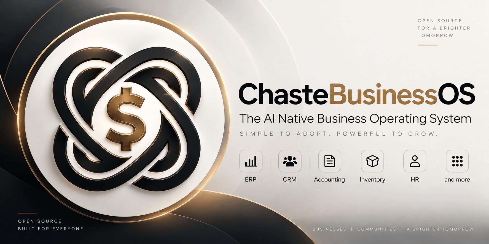

<div align="center">



# ChasteBusinessOS

**The agentic ERP. Describe your business, and an AI co-worker runs it under your authority.**

[](https://github.com/benaiah-muga/ChasteBusinessOS/releases)
[](https://github.com/benaiah-muga/ChasteBusinessOS/actions/workflows/ci.yml)
[](LICENSE)
[](tsconfig.base.json)
[](ROADMAP.md)
[](CONTRIBUTING.md)

[](VISION.md)
[](ARCHITECTURE.md)
[](ROADMAP.md)
[](CONTRIBUTING.md)
[](CODE_OF_CONDUCT.md)
[](SECURITY.md)
[](CHANGELOG.md)

[Features](#features) · [Quick start](#quick-start) · [How it works](#how-it-works) · [Demos](#demo-proofs) · [Docs](#documentation) · [Contributing](#contributing) · [License](#license)

</div>

---

Most ERPs fail at adoption, not at features. Teams spend months implementing them and years clicking through every screen by hand. ChasteBusinessOS takes a different position: you describe your business in plain language, an AI co-worker configures and operates as much as possible on your behalf, and every action it takes passes through the same governance yours does.

It cannot spend above your approval threshold without sign-off. It cannot assign itself a role. When it meets something it can't do, it files a ticket instead of improvising.

## Features

| Area | What works today |
|---|---|
| **Accounting** | Double-entry GL with immutable postings and mirror reversals, AR/AP subledgers, period close, trial balance, P&L, balance sheet, direct-method cash flow, customer and supplier statements, 13-week cash forecast |
| **Approvals** | Human-in-the-loop gates on money above thresholds; identity and destructive actions always require a person |
| **Audit** | Append-only hash-chained event ledger of everything humans and agents did; replayable agent session trajectories |
| **Sales** | Reservation-anchored orders: confirming checks credit headroom and reserves stock, delivery consumes reservations and invoices exactly what shipped, oversell is refused |
| **CRM** | Leads, deals pipeline with weighted forecasting, lead conversion, tasks with due dates, duplicate detection, and a customer 360 timeline merging invoices, payments, quotes, deals and tasks |
| **POS** | Register sessions, atomic cash/card sales, drawer counting with variance flagging, always-gated full-sale returns, and per-register shift summaries |
| **Purchasing** | Vendors, bills, purchase orders with goods receipts and three-way matching, payment terms, supplier price history and lead-time memory, close-with-backorder |
| **Inventory** | Append-only stock ledger with moving-average valuation, reorder alerts, reservations, cycle counts, locations, lots, internal transfers, barcodes, and GL reconciliation |
| **Manufacturing** | Multi-level BOMs with scrap allowances, work orders, production runs with full reversal, lot traceability, can-we-produce-N planning |
| **People & projects** | Employee structure, attendance with late flags, derived leave balances, recruitment-lite through to hire, projects kanban, and expense claims with policy limits and duplicate detection |
| **Marketing** | Saved deterministic segments, campaigns with opt-out honoured at send time, and the append-only send log as the analytics (no tracking pixels) |
| **Support** | Helpdesk tickets with numbers, priority/category/SLA, canned responses, KB articles, and SLA-breach signals |
| **Documents** | Folders, business-record links, and append-only version history with expiry signals |
| **Understanding** | `analytics.explainChange` decomposes a revenue change into exact, property-tested contributions with drill-to-invoice; `askYourBusiness` answers from cited extracts and proposes a governed action |
| **Signals** | Cross-module needs-attention registry: deterministic producers aggregated red-first with evidence and a suggested governed action |
| **Routines** | The agent on a schedule in plain language, running headless under a least-privilege bundle, silent on `NO_ACTION`, triggerable by webhook |
| **Messaging** | Team channels and DMs; the agent participates under its own authority |
| **Creator Mode** | The agent proposes platform changes as governed artifacts; humans merge |

## Quick start

Requirements: Node 24+ (matches CI), pnpm 11+, Go 1.27.1 (pinned in
`.go-version`), Postgres 16 **with pgvector**, and - optionally - one model
provider key (NVIDIA NIM ([build.nvidia.com](https://build.nvidia.com)) by
default, or OpenRouter, Groq, Mistral, or Z.ai (GLM) via `MODEL_PROVIDER`).

**Docker is not required.** The commands below use it for the database because
it is the shortest path, but [docs/SETUP.md](docs/SETUP.md) covers three
options - Docker, a hosted Postgres (Neon/Supabase/Railway, no containers at
all), and a native Postgres install - along with a troubleshooting table.

```sh
git clone https://github.com/benaiah-muga/ChasteBusinessOS.git
cd ChasteBusinessOS
pnpm install

cp .env.example .env        # add NVIDIA_API_KEY, BETTER_AUTH_SECRET, and SMTP settings

docker run -d --name chaste-pgvector \
  -e POSTGRES_PASSWORD=chaste_dev -e POSTGRES_USER=chaste \
  -e POSTGRES_DB=chaste_os_v2 -p 5433:5432 pgvector/pgvector:pg16

pnpm --filter @chaste/db db:migrate
pnpm db:provision-runtime
pnpm dev                    # Vite app on :3000, legacy compatibility server on :3001
# To opt into legacy boot migration locally: AUTO_MIGRATE_ON_BOOT=1 pnpm dev
# In another terminal, run the Go API on :8080:
pnpm dev:api
# In another terminal, run the Go capability/routine and outbox workers:
pnpm worker
```

`pnpm worker` loads the repository `.env`, builds both Go workers, and runs them
with signal forwarding for graceful shutdown. Routine scheduling and the Go
routine agent runner default on for local work; set either
`GO_ROUTINE_SCHEDULER=0` or `GO_ROUTINE_AGENT_RUNNER=0` to disable it. The jobs
worker uses `JOBS_WORKER_DATABASE_URL` and `GO_DATABASE_URL`, while the outbox
worker uses `OUTBOX_WORKER_DATABASE_URL`.

The sample `.env` enables Go onboarding and direct Vite onboarding with
`GO_ONBOARDING_ROUTE=1` and `CHASTE_GO_ONBOARDING_ROUTE=1`. The Vite selector
defaults off when unset; setting it to `0` restores the compatibility route as
an explicit rollback. Go handles onboarding GET, POST, and PATCH using the
signed-in session. If HTTPS terminates before Go, set
`GO_API_TRUSTED_PROXY_CIDRS` to the exact reverse-proxy peer CIDRs so Go can verify
the forwarded scheme without accepting another origin.
`GO_API_INTERNAL_URL` must identify the trusted Go API endpoint. HTTPS may point
to a remote or private service you control; the Vite development proxy accepts
cleartext HTTP only for loopback hosts.

## Why React and Go: measured build benefits

We chose React and TypeScript on Vite to shorten frontend compile feedback and
catch type errors early, and Go for fast, capable APIs and workers. This
benchmark shows the build-time improvement measured so far; type safety and
end-to-end request speed are migration goals that these build numbers do not
measure.

**Measured 2026-10-01**, on Linux x64 with an Intel Core i7-4600U, Node
24.18.0, pnpm 11.9.0, and Go 1.27.1. Each command ran three times in sequence
with shared dependency and compiler caches left warm between runs.

| Build | Command | Median | p95 | Median peak RSS |
| --- | --- | ---: | ---: | ---: |
| Next.js | `pnpm --filter web build` | 34.90 s | 340.19 s | 886,408 kB |
| Vite + React + TypeScript | `pnpm --filter @chaste/web-vite build` | 25.77 s | 27.20 s | 739,596 kB |
| Go API and workers | `go -C apps/api build ./cmd/api ./cmd/jobs-worker ./cmd/outbox-worker` | 4.41 s | 4.59 s | 255,360 kB |

In this sample, the Vite build median is about **26% lower** than the Next.js
median, and its median peak memory use is about **17% lower**. The three Go
binaries build in a **4.41-second median** with a 255,360 kB median peak RSS.
These are the compilation, build-time, and peak-memory benefits measured so
far in the migration.

The first Next.js run was cold and took 340.19 s; the next two took 34.02 s
and 34.90 s. With only three samples, p95 reflects this cold-build outlier.
The Vite command includes TypeScript checking. The full samples, peak memory,
and toolchain details are in the
[benchmark report](docs/migration/benchmarks/phase-4-previews.json) for
revision [`9bcce00`](https://github.com/benaiah-muga/ChasteBusinessOS/commit/9bcce00fc019cf24c1ab16db7b8cfd2ee78e3b21).

This snapshot compares build commands while the Vite app still has less feature
coverage than the existing app. It does not measure edit-to-ready or browser
navigation, so it is a build-time baseline rather than an end-to-end
development-speed claim. Refresh the report with:

```sh
pnpm benchmark:migration:builds --runs 3 --output docs/migration/benchmarks/phase-4-previews.json
```

The separate development-server startup sample, measured 2026-10-01 on the
same machine with three alternating runs and warm caches, recorded a lower
Vite median in this sample:

| Dev server | Command | Median process-spawn to TCP-listener time |
| --- | --- | ---: |
| Next.js compatibility app | `pnpm dev:legacy` | 3.491 s |
| React + Vite app | `pnpm dev:vite` | 2.767 s |

That is about 21% lower for Vite in this three-run sample. The previous sample
recorded 4.459 s for Vite and 4.341 s for Next, so startup results vary between
runs. This measurement records when each server first accepts a TCP connection,
not when a route finishes rendering or becomes usable in a browser. The full
samples, method, and machine details are in the
[startup benchmark report](docs/migration/benchmarks/phase-4-startup.json) for
revision [`cedea09`](https://github.com/benaiah-muga/ChasteBusinessOS/commit/cedea09abf54834d8b75f36a1d204110eed4fe48).
Refresh it with:

```sh
pnpm benchmark:migration:startup --runs 3 --output docs/migration/benchmarks/phase-4-startup.json
```

Edit-to-ready, route navigation, and demo-fixture comparisons remain to be
measured before claiming an end-to-end development-speed improvement.

Generate a random `GO_INTERNAL_AUTH_SECRET` in `.env` (for example,
`openssl rand -hex 32`). Set `GO_POLICY_SHADOW=1` to compare the Go policy read
with the existing database read during development; shadow comparison runs
only in development and only over loopback HTTP or HTTPS. `/api/policy` keeps
the existing response as its default. `GO_POLICY_READ=1` opts the GET into the
Go result after the signed session and permission checks, and requires the Go
API to be running. The POST remains on the existing governed capability path.
`GO_LEDGER_SHADOW=1` compares the ledger response during development while
still returning legacy data. `GO_LEDGER_READ=1` opts `GET /api/ledger` into Go
after the signed session and `accounting.read` checks; its route owner stays
legacy until the Go parity gates pass.
`GO_PROJECTS_WRITE=1` opts `POST /api/projects` into the signed Go capability
bridge; it requires `pnpm dev:api` and fails closed if Go is unavailable.
`GO_PROJECTS_READ=1` opts project list and board reads into the signed Go
reader; it also requires `pnpm dev:api` and fails closed on errors. The
development-only `GO_PROJECTS_SHADOW=1` compares the unaudited collection list
while returning legacy data. Board reads are not shadowed because their
capability audit entry must stay single.
`GO_APPROVAL_DECISION=1` opts approval POST decisions into the signed Go
service. It uses the exact payload stored with the pending approval and fails
closed if Go is unavailable or the outcome is unknown; approval queue and
history reads remain on the legacy handler.
`GO_ACCOUNTING_CREATE_INVOICE=1` opts only `action: "createInvoice"` on
`POST /api/accounting` into the signed Go capability bridge. It requires
`pnpm dev:api`, keeps the legacy approval response shape, and fails closed when
the invoice outcome cannot be confirmed. Every other accounting action and
the GET route remain on the legacy handler. The flag defaults to `0`.
`GO_ACCOUNTING_REPORTS_READ=1` opts the report capabilities used by
`GET /api/reports` into the signed Go executor. It requires `pnpm dev:api`,
preserves the response shape and currency metadata, and fails closed when Go
is unavailable or returns invalid data. The TypeScript path remains the
default and the flag defaults to `0`.
`GO_ACCOUNTING_INVOICE_READS=1` opts only the governed
`accounting.listInvoices` read inside `GET /api/accounting` into the signed Go
executor. It requires `pnpm dev:api`, preserves invoice fields, and fails
closed without a TypeScript retry when Go is unavailable or returns invalid
data. The TypeScript path remains the default and the flag defaults to `0`.
`GO_ACCOUNTING_CUSTOMER_STATEMENT_READS=1` opts only the
`customerStatement` action on `POST /api/accounting` into the signed Go
`accounting.customerStatement` capability. It requires `pnpm dev:api`, keeps
the `{ ok, data }` response shape, and fails closed without a TypeScript retry
when Go is unavailable or returns invalid data. The TypeScript path remains
the default and the flag defaults to `0`.
`GO_ACCOUNTING_CASH_FORECAST_READS=1` opts the cash forecast action on
`POST /api/accounting` into the signed Go `accounting.cashForecast` capability.
It requires `pnpm dev:api`, validates the 13-week forecast response, and fails
closed when Go is unavailable or returns invalid data. Missing stored scenario
assumptions use their defaults; explicit null values are rejected. The flag
defaults to `0`.
`GO_CRM_DEAL_WRITES=1` opts deal creation, stage changes, and lead conversion
into the signed Go capability bridge. It requires `pnpm dev:api`; reads and
other CRM actions remain on the legacy handler, and uncertain writes fail
closed without a TypeScript retry. The flag defaults to `0`.
`GO_CRM_DEAL_READS=1` opts `GET /api/deals` into a short-lived signed Go CRM
read. It requires `pnpm dev:api`, preserves the org-scoped 200-row response,
and fails closed if Go is unavailable or returns invalid data. The legacy route
remains the default; the flag defaults to `0`.
`GO_CRM_VIEW_READS=1` opts `GET /api/crm/views` into the signed Go saved-view
reader. It requires `pnpm dev:api`, preserves shared views and views created by
the current user, and fails closed if Go is unavailable or returns invalid
data. The legacy route remains the default; the flag defaults to `0`.
`GO_CRM_TIMELINE_READS=1` opts customer timeline reads on
`GET /api/crm?timeline=<customerId>` into the signed Go read capability. It
requires `pnpm dev:api`, preserves timeline fields, and fails closed when Go
is unavailable or returns invalid data. Task reads remain isolated; the legacy
route remains the default and the flag defaults to `0`.
`GO_SUPPORT_CONVERSATION_READS=1` opts customer-bound conversation lists on
`GET /api/support` into the signed Go `support.listConversations` read. It
requires `pnpm dev:api`; conversation detail and library reads use their own
flags. The flag defaults to `0`, and unavailable or invalid Go results fail
closed without a TypeScript retry.
`GO_SUPPORT_CONVERSATION_DETAIL_READS=1` opts `GET /api/support?id=<id>` into
the signed Go `support.readConversation` capability. It requires
`pnpm dev:api`, preserves the full conversation and message fields, returns the
oldest 200 messages in ascending order like the legacy route, and fails closed
on unavailable or invalid Go results. The flag defaults to `0`.
`GO_SUPPORT_LIBRARY_READS=1` opts `GET /api/support?library=1` into the signed
Go `support.listLibrary` capability. It requires `pnpm dev:api`, preserves
organization-scoped canned responses and knowledge articles, and returns
no-store responses while failing closed if Go is unavailable or returns
invalid data. The flag defaults to `0`.
`GO_CRM_VIEW_WRITES=1` opts `POST /api/crm/views` into the signed Go capability
bridge. It requires `pnpm dev:api`, preserves human session checks, approval
responses, and save/restore audit receipts, and fails closed if Go is
unavailable or returns invalid data. Other CRM actions remain on their current
handlers; the legacy executor remains the default and the flag defaults to `0`.
`GO_CRM_TASK_WRITES=1` opts CRM task creation, completion, and detail updates
into the signed Go capability bridge. It requires `pnpm dev:api`; reads,
follow-up drafting, and other CRM actions remain on their existing handlers.
The flag defaults to `0`, and uncertain task writes fail closed without a
TypeScript retry.
`GO_CRM_TASK_READS=1` opts the task-list query on `GET /api/crm` into the
signed Go `crm.listTasks` capability. It requires `pnpm dev:api`, preserves
open-task filtering and the existing response shape, and fails closed on
unavailable or invalid Go results. Other CRM reads remain on their current
handlers. The flag defaults to `0`.
Vite CRM list reads for deals, customers, tasks, saved views, and customer
timelines use Go's direct session-authenticated `GET /api/crm` API. The Go API
resolves the Better Auth session and active organization itself, so Vite does
not rely on Next.js to mint a read assertion. The Vite dev proxy selector
`CHASTE_GO_CRM_READS` and Go mount `GO_CRM_READ_ROUTE` are enabled in
`.env.example`; set both to `0` to temporarily restore the legacy read routes.
Go unavailability fails closed without retrying through Next.js.
`GO_CRM_IMPORT_WRITES=1` opts customer imports and customer import undo into
the signed Go capability bridge. It requires `pnpm dev:api`; product imports
remain on `GO_INVENTORY_IMPORT_WRITES`. The flag defaults to `0`, and uncertain
customer import outcomes fail closed without a TypeScript retry.
`GO_CRM_CUSTOMER_WRITES=1` opts customer creation, deactivation, merge, merge
undo, and profile updates into the signed Go capability bridge. It requires
`pnpm dev:api`; customer reads remain on the existing handler. The flag defaults
to `0`, and uncertain customer write outcomes fail closed without a TypeScript
retry.
`GO_IAM_TEAM=1` opts Team & Roles member and role reads and writes into the
signed Go capability bridge. It requires `pnpm dev:api`; the complete
registry-derived permission catalog stays available, identity actions retain
their approval rules, and uncertain writes fail closed without a TypeScript
retry. The flag defaults to `0`.
`GO_APPROVALS_READ=1` opts the approvals inbox and decision history GET into
the signed Go read bridge. It requires `pnpm dev:api`; the full TypeScript
capability registry still controls row visibility, and Go rechecks the active
session, organization membership, and live permissions. The flag defaults to
`0`. Approval decisions remain on their existing route path.
`GO_SALES_WRITE=1` opts sales order creation, confirmation, delivery, and
cancellation into the signed Go capability bridge. It requires `pnpm dev:api`;
order listing and other sales actions remain on the legacy handler, and
uncertain writes fail closed without a TypeScript retry. The flag defaults to
`0`.
`GO_SALES_LIST_ORDERS_READS=1` opts `GET /api/sales` into the signed Go
`sales.listOrders` capability. It requires `pnpm dev:api`, preserves status
filtering and the `{ orders }` response, and fails closed if Go is unavailable
or returns invalid data. TypeScript remains the default; the flag defaults to
`0`.
`GO_DOCUMENTS_LIST_READS=1` opts the authored-document list in `GET /api/docs`
into the signed Go `documents.listDocs` capability. It requires `pnpm dev:api`;
template reads remain on the legacy executor, and the combined response is
preserved. Unavailable or invalid Go results fail closed. TypeScript remains
the default; the flag defaults to `0`.
`GO_DOCUMENT_INGESTED_READS=1` opts ingested document list and detail reads in
`GET /api/documents` into the signed Go
`documents.listIngestedDocuments` capability. It requires `pnpm dev:api`,
preserves the list, vendors, detail, and `preview=1` projections, and excludes
stored raw text and base64 content. Unavailable or invalid Go results fail
closed. TypeScript remains the default; the flag defaults to `0`.
The Vite library can select the direct session-capability route by setting
`CHASTE_GO_DOCUMENT_INGESTED_READS=1` and
`CHASTE_GO_SESSION_CAPABILITY_ROUTE=1`. The API feature flag above is enforced
inside the capability route for all callers. List and preview detail keep the
same projections, and uploaded-content links remain on their existing path.
`GO_MESSAGING_PEOPLE_READS=1` opts only the authenticated Go
`messaging.listPeople` capability into direct session-route execution. The API
flag defaults off and gates all callers. Vite can select it with
`CHASTE_GO_MESSAGING_PEOPLE_READS=1` plus
`CHASTE_GO_SESSION_CAPABILITY_ROUTE=1`. Initial mention lookup requests 100
people; add-member search requests 30 and trims queries to 80 characters.
Conversation, thread, presence, and message search reads retain their current
routes. Selected Go failures are shown in the existing Messages notices and do
not fall back to legacy.
The Vite authored-document editor can separately select Go for version history
and archived compare previews with `CHASTE_GO_DOCUMENTS_VERSION_READS=1` and
`CHASTE_GO_SESSION_CAPABILITY_ROUTE=1`. The API must also set
`GO_DOCUMENTS_VERSION_READS=1`; Go enforces that gate for both capabilities and
all callers. Document content, collaboration, and editor writes retain their
existing routes.
For the editor's primary detail read, set `CHASTE_GO_DOCUMENTS_EDITOR_READS=1`
as well as the version-read selector above. Go then supplies both `getDoc` and
`listDocVersions`, gated by `GO_DOCUMENTS_EDITOR_READS=1` and
`GO_DOCUMENTS_VERSION_READS=1` on the API. This avoids a legacy detail request
for version rows while Go supplies the primary body. A selected Go detail error
fails closed; workspace, presence, autosave, collaboration, and writes keep
their existing routes.
`GO_DOCUMENTS_VERSION_READS=1` opts authored document version history and
single-version reads on `GET /api/docs/:id` into the signed Go
`documents.listDocVersions` and `documents.getDocVersion` capabilities. It
requires `pnpm dev:api`, preserves the current document read and public
response projections, and fails closed after Go dispatch. TypeScript remains
the default; the flag defaults to `0`.
`GO_ACCOUNTING_QUOTES_WRITE=1` opts quote creation, acceptance, decline, and
expiry sweeps into the signed Go capability bridge. It requires `pnpm
dev:api`; the dedicated quotes route and other accounting actions remain on
their existing handlers, and uncertain writes fail closed without a
TypeScript retry. The flag defaults to `0`.
`GO_ACCOUNTING_QUOTES_READS=1` opts `GET /api/quotes` into the signed Go
`accounting.listQuotes` read. It requires `pnpm dev:api`, preserves the
status filter and response shape, and fails closed if Go is unavailable or
returns invalid data. TypeScript remains the default; the flag defaults to
`0`.
`GO_ACCOUNTING_RECORD_PAYMENT_WRITE=1` opts `accounting.recordPayment` on
`POST /api/accounting` into the signed Go capability bridge. It requires
`pnpm dev:api`; other accounting actions stay on their existing handlers, and
uncertain payment outcomes fail closed without a TypeScript retry. The flag
defaults to `0`.
`GO_ACCOUNTING_REVERSE_PAYMENT_WRITE=1` opts `accounting.reversePayment` on
`POST /api/accounting` into the signed Go capability bridge. It requires
`pnpm dev:api`; approval and error responses are preserved, and uncertain
outcomes fail closed without a TypeScript retry. The flag defaults to `0`.
`GO_ACCOUNTING_FX_RATE_WRITE=1` opts `accounting.recordFxRate` on
`POST /api/accounting` into the signed Go capability bridge. It requires
`pnpm dev:api`; other accounting actions stay on their existing handlers, and
uncertain outcomes fail closed without a TypeScript retry. The flag defaults
to `0`.
`GO_ACCOUNTING_FX_REVALUATION_WRITE=1` opts the `revalue` action on
`POST /api/accounting/close` into the signed Go
`accounting.revalueForeignReceivables` capability. It requires `pnpm dev:api`,
preserves the permission check, approval responses, and revaluation result,
and fails closed on unavailable or malformed Go responses without a TypeScript
retry. Other period-close actions remain controlled by
`GO_ACCOUNTING_PERIOD_CLOSE_WRITES`; this flag defaults to `0`.
`GO_ACCOUNTING_RECURRING_WRITE=1` opts recurring invoice template creation,
pausing, and resumption into the signed Go capability bridge. It requires
`pnpm dev:api`; the dedicated recurring route and other accounting actions
remain on their existing handlers, and uncertain writes fail closed without a
TypeScript retry. The flag defaults to `0`.
`GO_HR_EMPLOYEE_WRITES=1` opts employee hiring, deactivation, and structure
updates into the signed Go capability bridge. It requires `pnpm dev:api`;
leave, payroll, and other HR actions remain on the legacy handler, and
uncertain writes fail closed without a TypeScript retry. The flag defaults to
`0`.
`GO_ACCOUNTING_EXPENSE_WRITES=1` opts expense claim submission, decisions,
payments, and policy changes into the signed Go capability bridge.
`GO_ACCOUNTING_EXPENSE_READS=1` opts expense claim and policy reads into Go.
Both flags require `pnpm dev:api` and default to `0`; other accounting actions
remain on their existing handlers. Uncertain writes fail closed without a
TypeScript retry, while unavailable reads fail closed without querying the
legacy database.
`GO_PURCHASING_BILL_WRITES=1` opts vendor and bill creation and bill payments
into the signed Go capability bridge. Other purchasing actions remain on their
existing handlers. It requires `pnpm dev:api`; uncertain writes fail closed
without a TypeScript retry. The flag defaults to `0`.
`GO_PURCHASING_PO_WRITES=1` opts purchase order creation into the signed Go
capability bridge. Other purchasing actions remain on their existing
handlers. It requires `pnpm dev:api`; uncertain writes fail closed without a
TypeScript retry. The flag defaults to `0`.
`GO_PURCHASING_PO_CLOSE_WRITES=1` opts only `closePurchaseOrder` on
`POST /api/purchasing` into the signed Go capability bridge. It requires
`pnpm dev:api`; approval responses are preserved and uncertain outcomes fail
closed without a TypeScript retry. Purchase order creation and other actions
remain on their existing handlers. The flag defaults to `0`.
`GO_PURCHASING_BILL_CREDIT_WRITES=1` opts `billCreditNote` on
`POST /api/purchasing` into the signed Go capability bridge. It requires
`pnpm dev:api`; approval responses are preserved and uncertain outcomes fail
closed without a TypeScript retry. Other purchasing actions remain on their
existing handlers. The flag defaults to `0`.
`GO_PURCHASING_REVERSE_VENDOR_PAYMENT_WRITE=1` opts
`purchasing.reverseVendorPayment` on `POST /api/purchasing` into the signed Go
capability bridge. It requires `pnpm dev:api`; approval responses are
preserved and uncertain outcomes fail closed without a TypeScript retry. The
flag defaults to `0`.
`GO_PURCHASING_RECEIPT_READS=1` opts the `receiptDetail` action on
`POST /api/purchasing` into the signed Go read capability. It requires
`pnpm dev:api`, preserves the receipts and order-line response, and fails
closed if Go is unavailable or returns invalid data. The TypeScript path
remains the default and the flag defaults to `0`.
`GO_PURCHASING_WORKFLOW_READS=1` opts the requests and RFQs section of
`GET /api/purchasing` into the signed Go `purchasing.listPurchaseWorkflow`
read. It requires `pnpm dev:api`, preserves decision reasons, vendor names,
quote notes, ordering, and timestamps, and fails closed when Go is unavailable
or returns invalid data. Other purchasing reads stay on their existing paths;
the TypeScript path remains the default and the flag defaults to `0`.
The Vite page can separately source only its requests and RFQs from the direct
authenticated capability route with
`CHASTE_GO_PURCHASING_WORKFLOW_READS=1` and
`CHASTE_GO_SESSION_CAPABILITY_ROUTE=1`. Keep
`GO_PURCHASING_WORKFLOW_READS=1` enabled on the API as the server-side
capability gate. Vite keeps the aggregate workspace request for its other data
and replaces only `workspace.requests`; selected Go failures stop the page
load without a retry through the aggregate request.
`GO_PURCHASING_AP_AGING_READS=1` opts the accounts payable aging report in
`GET /api/purchasing` into the signed Go `purchasing.apAging` read. It requires
`pnpm dev:api`, preserves the current, 31-60 day, 61-90 day, over-90 day, and
total outstanding buckets in the workspace currency, and fails closed if Go
is unavailable or returns invalid data. The TypeScript path remains the
default and the flag defaults to `0`.
`GO_PURCHASING_SUPPLIER_PERFORMANCE_READS=1` opts the supplier performance
metrics in `GET /api/purchasing` into the signed Go
`purchasing.supplierPerformance` read. It requires `pnpm dev:api`, preserves
vendor order counts, average lead times, on-time and fill rates, and backorder
counts, and fails closed if Go is unavailable or returns invalid data. The
TypeScript path remains the default and the flag defaults to `0`.
`GO_PURCHASING_PAYMENT_RUN_READS=1` opts `GET /api/purchasing/payment-runs`
into the signed Go `purchasing.listPaymentRuns` read. It requires
`pnpm dev:api`, preserves run state and bill-level remittance fields, and fails
closed when Go is unavailable or returns invalid data. The TypeScript path
remains the default and the flag defaults to `0`. Existing deployments with
`GO_PURCHASING_PAYMENT_RUN_WRITES=1` continue to route this read through Go.
`GO_INVENTORY_STOCK_WRITES=1` opts stock adjustments and stock transfer
creation, confirmation, cancellation, and reversal into the signed Go
capability bridge. Other inventory actions remain on their existing handlers.
It requires `pnpm dev:api`; uncertain writes fail closed without a TypeScript
retry. The flag defaults to `0`.
`GO_INVENTORY_ITEM_HISTORY_READS=1` opts `GET /api/inventory?sku=...` into
the signed Go `inventory.itemHistory` read. It requires `pnpm dev:api`, keeps
the `{ movements }` response and missing-item behavior, and fails closed if
Go is unavailable or returns invalid data. TypeScript remains the default;
the flag defaults to `0`.
The Vite app can route this same SKU history request through the direct
session-authenticated Go inventory reader by pairing
`CHASTE_GO_INVENTORY_READ_ROUTE=1` with `GO_INVENTORY_READ_ROUTE=1`. The API
flag gates the handler server-side; selected Go errors are returned directly,
and the Vite client validates the exact movement envelope.
`GO_INVENTORY_STOCK_REPORT_READS=1` opts the stock report and reorder-alert
reads on `GET /api/inventory` into two signed Go `inventory.stockReport`
capability calls. It requires `pnpm dev:api`, preserves the report and alert
fields, and fails closed if Go is unavailable or either result is invalid.
Other inventory reads remain on their existing handlers unless their dedicated
read flags below are enabled. TypeScript remains the default; the flag defaults
to `0`.
`GO_INVENTORY_ITEM_METADATA_READS=1` opts the item metadata query on
`GET /api/inventory` into the signed Go `inventory.listItemMetadata` read. It
requires `pnpm dev:api`, preserves the item IDs and catalog fields merged into
stock report rows, and fails closed if Go is unavailable or returns invalid
data. The TypeScript path remains the default and the flag defaults to `0`.
`GO_INVENTORY_TRANSFER_READS=1` opts the transfer list on `GET /api/inventory`
into the signed Go `inventory.listTransfers` read. It requires `pnpm dev:api`,
preserves the 50-row limit, transfer routes, notes, and line quantities, and
fails closed if Go is unavailable or returns invalid data. The flag defaults
to `0`.
`GO_INVENTORY_LOTS_READS=1` opts the lot list on `GET /api/inventory` into the
signed Go `inventory.listLots` read. It requires `pnpm dev:api`, preserves the
200-row newest-first order, SKU, lot code, expiration timestamp, and response
fields, and fails closed if Go is unavailable or returns invalid data. The
flag defaults to `0`.
`GO_INVENTORY_RESERVATIONS_READS=1` opts the reservation list on
`GET /api/inventory` into the signed Go `inventory.listReservations` read. It
preserves all statuses, the 100-row newest-first order, the full route fields,
and fails closed if Go is unavailable or returns invalid data. The flag
defaults to `0`.
`GO_INVENTORY_CYCLE_COUNTS_READS=1` opts the cycle-count list on
`GET /api/inventory` into the signed Go `inventory.listCycleCounts` read. It
requires `pnpm dev:api`, preserves the 20-row newest-first order, location,
status, note, timestamps, line quantities, and nullable count and variance
fields, and fails closed if Go is unavailable or returns invalid data. The
flag defaults to `0`.
`GO_INVENTORY_LOCATIONS_READS=1` opts the stock location list on
`GET /api/inventory` into the signed Go `inventory.listLocationRecords` read. It
requires `pnpm dev:api`, preserves the legacy row fields and code ordering,
returns full org-scoped rows from Go without a second TypeScript location query,
and fails closed if Go is unavailable or returns invalid data. The existing
`inventory.listLocations` routine tool keeps its code/name response shape. The
flag defaults to `0`.
`GO_INVENTORY_BARCODE_LOOKUP_READS=1` opts the `lookupByBarcode` action on
`POST /api/inventory` into the signed Go `inventory.lookupByBarcode` read. It
requires `pnpm dev:api`, preserves the legacy response envelope and nullable
item result, validates every item field, and fails closed if Go is unavailable
or returns invalid data. The flag defaults to `0`.
`GO_INVENTORY_VALUATION_SUMMARY_WRITE=1` opts the existing
`postValuationSummary` action on `POST /api/inventory` into the signed Go
`inventory.postValuationSummary` capability. It requires `pnpm dev:api`,
preserves the memo, approval, error, and no-op response behavior, and fails
closed without a TypeScript retry if Go is unavailable or returns invalid data.
The flag defaults to `0`.
`GO_POS_WRITES=1` opts register opening, sales, closing, returns, and shift
summaries into the signed Go capability bridge. It requires `pnpm dev:api`;
uncertain writes fail closed without a TypeScript retry. The flag defaults to
`0`.
`GO_POS_SHIFT_SUMMARY_READS=1` opts only the shift-summary action into Go
independently of `GO_POS_WRITES`; its default is `0`. When `GO_POS_WRITES=1`,
the existing Go dispatch behavior for shift summaries is preserved.
`GO_ACCOUNTING_INVOICE_OPS_WRITE=1` opts credit notes and journal entry
reversals into the signed Go capability bridge. It requires `pnpm dev:api`;
other accounting actions remain on their existing handlers, and uncertain
writes fail closed without a TypeScript retry. The flag defaults to `0`.
`GO_BANKING_WRITES=1` opts bank account creation, feed imports, transaction
matching, unmatching, exclusions, and deletion into the signed Go capability
bridge. It requires `pnpm dev:api`; the reconciliation view and other
accounting actions remain on their existing handlers, and uncertain writes
fail closed without a TypeScript retry. The flag defaults to `0`.
`GO_PURCHASING_REQUEST_WRITES=1` opts purchase requests, request decisions,
RFQs, quote recording, and winning-quote selection into the signed Go
capability bridge. It requires `pnpm dev:api`; other purchasing actions remain
on their existing handlers, and uncertain writes fail closed without a
TypeScript retry. The flag defaults to `0`.
`GO_INVENTORY_ITEM_WRITES=1` opts item creation, updates, archiving, and
location creation into the signed Go capability bridge. It requires `pnpm
dev:api`; other inventory actions remain on their existing handlers, and
uncertain writes fail closed without a TypeScript retry. The flag defaults to
`0`.
`GO_ACCOUNTING_TAX_RETURNS_WRITE=1` opts sales tax return filing into the
signed Go capability bridge. It requires `pnpm dev:api`; tax profile and code
management ride the executor and worker without a route flag, other
accounting actions remain on their existing handlers, and uncertain writes
fail closed without a TypeScript retry. The flag defaults to `0`.
`GO_HR_LEAVE_TIME_WRITES=1` opts leave requests, decisions, cancellation, and
clock in/out into the signed Go capability bridge. It requires `pnpm dev:api`;
leave balances, calendars, and reports stay on their existing handlers, and
uncertain writes fail closed without a TypeScript retry. The flag defaults to
`0`.
`GO_HR_PAYROLL_APPLICANT_WRITES=1` opts payroll run creation, execution,
voiding, and the applicant pipeline through hire into the signed Go
capability bridge. It requires `pnpm dev:api`; applicant listing has its own
read flag, and other HR actions remain on their existing handlers. Uncertain
writes fail closed without a TypeScript retry. The flag defaults to `0`.
`GO_HR_APPLICANT_READS=1` opts applicant lists in `GET /api/hr` into the signed
Go `hr.listApplicants` read. It requires `pnpm dev:api`, preserves each
opening's applicant fields and ordering, and fails closed if Go is unavailable
or returns invalid data. The TypeScript path remains the default and the flag
defaults to `0`.
The Vite HR Overview report can separately use the authenticated Go `hr.report`
capability with `CHASTE_GO_HR_OVERVIEW_REPORT_READS=1` and
`CHASTE_GO_SESSION_CAPABILITY_ROUTE=1`. The Vite example config enables it.
Failures on the selected Go route are shown without retrying through `/api/hr`;
set the selector to `0` to return Overview to `/api/hr`. Other HR tabs keep
their independently selected report routes.
`GO_PURCHASING_AP_AGING_READS=1` opts the supplier AP aging read into the
signed Go capability bridge. It requires `pnpm dev:api`; other purchasing
reads and all writes remain on their existing handlers. The same default-off
flag gates `purchasing.apAging` on the session capability route. The flag
defaults to `0`. Vite direct reads additionally require
`CHASTE_GO_PURCHASING_AP_AGING_READS=1` and
`CHASTE_GO_SESSION_CAPABILITY_ROUTE=1`.
`GO_PURCHASING_PRICE_HISTORY_READS=1` opts the supplier price history read into
the signed Go `purchasing.priceHistory` capability. It requires `pnpm dev:api`,
preserves the existing response shape, and fails closed if Go is unavailable
or returns invalid data. Other purchasing reads and all writes remain on their
existing handlers. The flag defaults to `0`.
`GO_PURCHASING_SUPPLIER_STATEMENT_READS=1` opts the `supplierStatement` action
on `POST /api/purchasing` into the signed Go `purchasing.supplierStatement`
capability. It requires `pnpm dev:api`, preserves the existing response shape,
and fails closed if Go is unavailable or returns invalid data. Other purchasing
reads and all writes remain on their existing handlers. The flag defaults to
`0`.
`GO_HR_OPENINGS_WRITE=1` opts job opening creation and closure into the
signed Go capability bridge. It requires `pnpm dev:api`; applicant actions
remain on their existing handlers, and uncertain writes fail closed without a
TypeScript retry. The flag defaults to `0`.
`GO_ACCOUNTING_REMINDERS_READS=1` opts payment reminder building into the
signed Go capability bridge. It requires `pnpm dev:api`; everything else in
accounting remains on its existing handlers. The flag defaults to `0`.
Manufacturing and marketing capabilities run on the Go executor and worker
without route flags: no public route serves them today, so they are reachable
only through governed agent and worker dispatch.

The local `.env.example` mounts Go authentication. Vite sends only the auth
methods and paths implemented by Go to it; other auth requests continue to the
legacy Better Auth catch-all. Go auth mounts by default and requires
`BETTER_AUTH_SECRET` plus `GO_AUTH_MODE` set to `development` or `production`.
Set `GO_AUTH_ROUTE=0` to disable the Go mount; Vite then keeps auth on the legacy
bridge. `CHASTE_GO_AUTH_ROUTE=0` also explicitly selects the legacy bridge.
Auth mode is independent of `NODE_ENV`. Production
mode requires `GO_AUTH_PUBLIC_ORIGIN` to
be an HTTPS origin and `GO_AUTH_SECURE_COOKIE=true`. Development mode may use
the local app URL fallback. Configure `SMTP_HOST`, `SMTP_PORT`, `SMTP_SECURE`,
`SMTP_USER`, `SMTP_PASS`, and `SMTP_FROM` for verification and recovery email.
Auth links are stored in a PostgreSQL outbox and retried with bounded backoff;
delivery jobs expire with their links. Production deployments should enable
the Go route only after the auth continuity and security gates pass.

An optional provider-neutral OIDC authorization-code flow is available when
`GO_OIDC_ENABLED=1` is paired with `GO_AUTH_ROUTE=1`. Configure the exact HTTPS
issuer, client credentials, and registered Go callback URI
`https://<api-host>/api/auth/callback/oidc`. The callback validates issuer,
signature, audience, nonce, state, and PKCE before creating a Go-owned session;
it never stores or returns provider tokens. Set
`GO_OIDC_ALLOWED_ENDPOINT_HOSTS` to exact comma-separated `host[:port]`
authorities only when discovery uses endpoints on a different host than the
configured issuer. Every discovered endpoint, including JWKS, must use HTTPS
and an allowed authority; requests have bounded timeouts and do not follow
redirects. Multi-audience ID tokens require `azp` to equal the configured
client ID. The configured issuer authority and explicit endpoint authorities
are trusted operator configuration. The transport constrains host and port but
does not pin DNS-resolved IPs, so a configured authority can resolve to a
private destination. Only configure authorities you trust, including their DNS
control and network routing.
`GO_OIDC_TRUST_VERIFIED_EMAIL=true` only when the issuer is trusted to attest
`email_verified`, which is required before attaching an OIDC subject to an
existing email account. Browser clients finish with the existing Go session
cookie. Native clients can opt in by setting `GO_OIDC_NATIVE_REDIRECT_URI` to
their exact custom-scheme callback URI. They start `/api/auth/sign-in/oidc`
with `native_code_challenge` and `native_state`, receive a short-lived code at
that callback, then exchange it at `POST /api/auth/native/exchange` with the
PKCE verifier. The reusable bearer token is returned only in that no-store
JSON response, never in the redirect URL. Leaving the native redirect unset
disables the handoff. The local Vite development stack routes authentication
to Go; production ownership still follows the auth continuity and security
gates.

An optional Go SAML sign-in flow is enabled with `GO_SAML_ENABLED=1` and
`GO_AUTH_ROUTE=1`. Pin the IdP issuer, HTTPS SSO endpoint, and one signing
certificate. Configure the SP entity ID, exact HTTPS ACS URL, HTTPS success
URL, and attribute names. The IdP must sign the SAML response. Verified-email
trust is explicit through `GO_SAML_TRUST_VERIFIED_EMAIL=true`; the handler
rejects untrusted email linking. Go mounts `/api/auth/sign-in/saml` and
`/api/auth/callback/saml` only when both flags are enabled.

`GO_SUPPORT_PUBLIC_ROUTE=1` opts the Go API into the public
`/api/support/public` widget endpoint. It uses NVIDIA embeddings for published
knowledge search, so `NVIDIA_API_KEY` and `GO_SUPPORT_EMBEDDING_MODEL` must be
configured. Run the jobs worker with `GO_SUPPORT_EMBEDDING_WORKER=1` to index
published articles. Tenant candidates are discovered through a bounded,
least-privilege worker function; article reads and writes run inside
`dbx.WithOrgTx`. To exercise this route from the Vite widget, pair it with
`CHASTE_GO_SUPPORT_PUBLIC_ROUTE=1`; the proxy selects only the exact widget
endpoint and preserves request methods, bodies, cookies, query parameters, and
streamed responses. Both route flags and the embedding worker default to off,
so production route ownership stays unchanged unless both route flags are
deliberately enabled. Set `GO_SUPPORT_TRUSTED_PROXY_CIDRS` only to trusted
reverse proxy networks; forwarded addresses from other peers are ignored.

When Go auth is enabled, the Vite development proxy sends every method and path
under `/api/auth` to Go, including unsupported compatibility paths, which Go
rejects with 404 or 405. Set `CHASTE_GO_AUTH_ROUTE=0` to restore the legacy
Better Auth catch-all. Set `CHASTE_GO_AUTH_OIDC_ROUTE=1` or
`CHASTE_GO_AUTH_SAML_ROUTE=1` alongside the matching Go auth feature flag to
route those optional federation paths to Go. Most other Go route flags are opt-in
and evaluated against the request method and exact path before the legacy
`/api` catch-all; unmatched requests continue to the legacy server. Request and
response streams, headers, query strings, and bodies pass through unchanged.
Pair `GO_MY_WORK_ROUTE=1` with `CHASTE_GO_MY_WORK_ROUTE=1` to send only
`GET /api/my-work` to Go. The local `.env.example` enables the session-authenticated Go
`GET /api/analytics` discovery and preview route; report `POST /api/analytics`
remains on legacy by default. Route only report generation to Go by setting
`GO_ANALYTICS_REPORT_ROUTE=1` and `CHASTE_GO_ANALYTICS_REPORT_ROUTE=1`;
the API flag defaults to `0`. GET discovery and preview ownership remains
controlled by the existing analytics GET selectors. Set both
`GO_ANALYTICS_ROUTE=0` and `CHASTE_GO_ANALYTICS_ROUTE=0` to use the legacy
handler during local rollback. Vite's selectors apply only to its development
server; production reverse-proxy ownership is configured separately. Go also
implements the work brief at
`POST /api/my-work/summarize` behind `GO_MY_WORK_SUMMARY_ROUTE=1`. Its paired
Vite method/path selector is pending; leave `CHASTE_GO_MY_WORK_SUMMARY_ROUTE=0`
until that selector is wired. The handler uses the authenticated user's own
default OpenCode connection with tools disabled, or the same user's isolated
Codex home and read-only CLI mode. Codex requires a persistent home shared with
the connection setup runtime. Missing runtimes, unsupported providers, and
provider failures return an error without substituting workspace credentials.

`GO_SCIM_READ_ROUTE=1` opts the Go API into SCIM 2.0 collection and single-user
reads at `/api/scim/v2/Users`. It resolves hashed, unexpired bearer tokens
through a narrowly granted database function and runs user reads in an
organization-scoped transaction. `GO_SCIM_WRITE_ROUTE=1` separately enables
provisioning and deactivation through governed external-IdP capabilities.
Standard SCIM clients can omit `Idempotency-Key`; the backend deduplicates
retries within each membership generation. Clients may send a UUID key to
define an explicit operation. Go mounts SAML sign-in and assertion-consumer
routes when the SAML provider configuration is present; Vite forwards those
routes when `CHASTE_GO_AUTH_SAML_ROUTE=1`. OIDC sign-in can be enabled with
the provider configuration above.

For a production-shaped local Docker run, use the full Compose stack instead:

```sh
cp .env.example .env       # set BETTER_AUTH_SECRET
docker compose up -d --build
curl http://localhost:3000/api/health
```

The app runs migrations during production boot and connects to Compose Postgres
at `db:5432`. `node scripts/verify-docker.mjs` performs the same flow on
isolated ports and cleans up afterward.

Sign up, describe your business in two sentences, and the workspace builds itself: chart of accounts seeded, description embedded into org memory, owner role granted to you.

## How it works

One rule holds the whole system together: there is exactly one way to change state, and humans and agents share it.

```
intent → resolve capability → validate input → check permissions
      → policy evaluation → [execute | request approval]
      → append to ledger → notify
```

Clicking "pay invoice" in the UI and typing "pay the Acme invoice" in chat reach the same executor with the same capability ID. One path means one place for security review, and automatic parity between what you can do and what your AI co-worker can do.

Capabilities carry their own contract: zod schemas, risk class (`read`, `write`, `money`, `identity`, `destructive`), permission reference, and an inverse action so state changes stay reversible. The registry validates all of it at boot; a module declaring an inverse that doesn't exist refuses to start the server.

## Demo proofs

Each script is an executable specification. If one fails, that's a bug worth knowing about.

```sh
pnpm demo:slice   # customer → invoice → gated payment → approval → trial balance
pnpm demo:m4      # vendor bill → gated payment → P&L and balance sheet prove out
pnpm demo:m5      # register session → sales → drawer variance flagged
pnpm demo:m7      # inventory → GL reconciliation, transfers, products
pnpm demo:m8      # needs-attention signals, governed reorder approve/decline
pnpm demo:m9      # quote-to-cash: fulfillment, credit guard, expiry, customer 360
pnpm demo:m10     # cash flow, credit notes, statements, reminders, forecast
pnpm demo:m11     # hire → project → time → expense → approve
pnpm demo:m12     # revenue decomposition, ask-your-business, tickets, documents
pnpm demo:m13     # POS returns, shift summaries, marketing-lite
```

Most take a subcommand to run one proof, e.g. `pnpm demo:m9 fulfillment`.
Every demo needs a migrated database. Some also drive the real agent and need a
model provider key - CI skips the keyed demo set when no key is configured, so
a missing key looks like a skipped job rather than a failure. The G52
`demo:slice` proof does not call a model.

For the G52 Go-backed `demo:slice` proof, set `GO_DATABASE_URL` to the
provisioned `chaste_app` connection and set `GO_INTERNAL_AUTH_SECRET` to at
least 32 bytes (`openssl rand -hex 32` generates 32 random bytes as hex). Start
the Go API in another terminal with `pnpm dev:api`, then run `pnpm demo:slice`.
The proof exercises Go capability, approval, and trial-balance APIs; public
business routes remain legacy-owned during the migration.

## Upgrading

Updates ship as new app code plus incremental database migrations. Your data
survives updates: migrations are additive `ALTER`s applied in place by
Drizzle's idempotent migrator, and a `pg_dump` snapshot is taken
automatically before any migration runs.

```sh
git pull            # get the new version
pnpm install
pnpm --filter @chaste/db db:migrate  # local development
pnpm dev                              # local development, migrations are explicit
pnpm build && pnpm start              # production, migrations run on boot
```

Production applies pending migrations once at boot before accepting requests
(serialized across instances by a Postgres advisory lock), so a deployment
doesn't serve new code against an old schema. Local development migrates
explicitly to keep restarts quick.

Controls and safety nets:

- Pre-migration snapshots live in `packages/db/backups/` (newest 10 kept).
  Restore one with `psql "$DATABASE_URL" < <snapshot>.sql` after stopping the
  app. Snapshots use the host `pg_dump`, falling back to the one inside the
  database container when the host client is missing or older than the
  server; override with `CHASTE_PG_DUMP_BIN` (a command with flags) or rename
  the container with `CHASTE_DB_CONTAINER`.
- Set `CHASTE_STRICT_MIGRATION_BACKUP=1` in production to refuse migrating
  when a snapshot cannot be taken (e.g. `pg_dump` not installed and no
  container fallback available).
- Local `pnpm dev` skips boot migration by default. Apply schema changes with
  `pnpm --filter @chaste/db db:migrate`, or set `AUTO_MIGRATE_ON_BOOT=1` to
  opt into boot migration during local development.
- Production still migrates on boot by default. Set
  `AUTO_MIGRATE_ON_BOOT=0` only when your release process runs migrations
  separately before starting the new app version.
- Upgrade notes for behavioral changes are in [CHANGELOG.md](CHANGELOG.md)
  under the version you're moving to.

## Documentation

- [Setup guide](docs/SETUP.md), local setup with or without Docker, plus troubleshooting
- [Vision](VISION.md), what we're building and what we won't compromise
- [Architecture](ARCHITECTURE.md), capability kernel, governance pipeline, memory tiers
- [Roadmap](ROADMAP.md), milestones and standing principles
- [ADRs](docs/adr/), why things are the way they are
- [Changelog](CHANGELOG.md), every behavioral change, per Keep a Changelog

## Contributing

Read [AGENTS.md](AGENTS.md) even if you're human. It defines the conventions, the verification gate (typecheck, lint, tests, then break a demo), and the rules for authoring new capabilities. Significant decisions get an ADR; behavioral changes get a changelog entry.

See [CONTRIBUTING.md](CONTRIBUTING.md) and our [Code of Conduct](CODE_OF_CONDUCT.md).

## Security

Found something exploitable? Please report privately per [SECURITY.md](SECURITY.md) rather than opening an issue.

## License

[Apache License 2.0](LICENSE)
