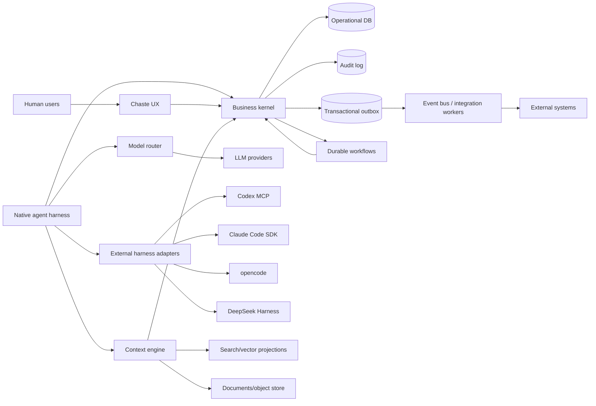
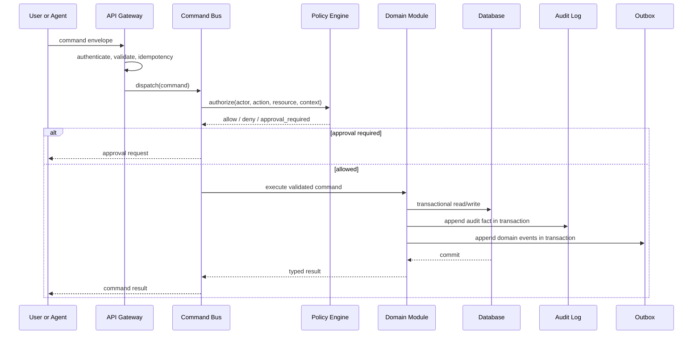
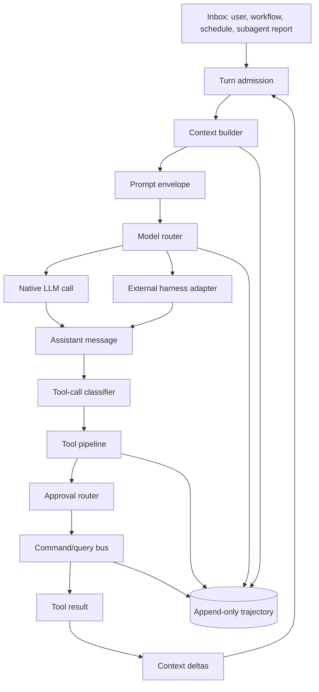
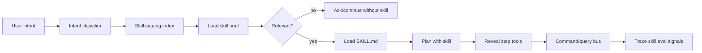
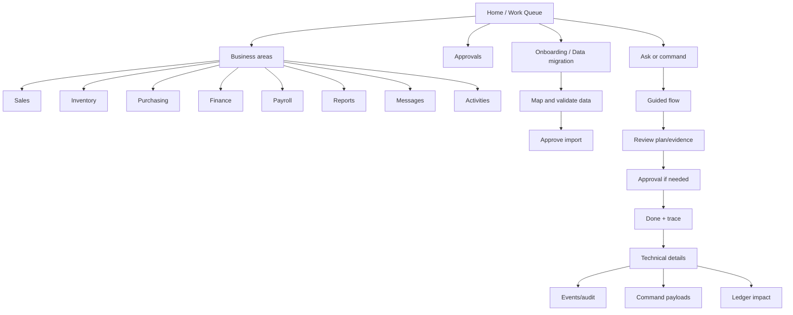
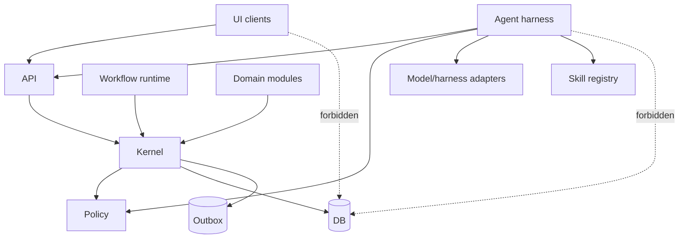

# Future Architecture of ChasteBusinessOS

Date: 2026-08-15

Status: research-backed greenfield design

Scope: This document designs ChasteBusinessOS as if no implementation exists. It does not describe, preserve, or migrate any current code.

## Executive Thesis

ChasteBusinessOS should be built as a trustworthy business execution harness, not as an ERP with a chatbot. The durable product boundary is a deterministic business kernel: commands, queries, authorization, audit, validation, workflows, ledgers, documents, and domain events. The AI layer is an operator that can perceive, plan, ask, execute, explain, and recover only by using the same business capabilities available to humans.

The central architectural rule is:

> If the agent can do it, a human can do the same thing through the same command/query contract, subject to the same authorization, validation, approval, audit, and domain invariants.

The long-lived moat is therefore not a single model or prompt. It is the harness: capability design, context assembly, policy enforcement, durable execution, model-visible logging, trace replay, human approval, business provenance, and evaluation.

## Research Base

Primary sources reviewed:

- DeepSeek Harness repository and architecture docs: plugin-first Cordis runtime, append-only session log, scoped capabilities, tool execution pipeline, session replay, subagent continuation, capability seams, and model-visible logging.
  - https://github.com/deepseek-ai/deepseek-harness
  - https://github.com/deepseek-ai/deepseek-harness/blob/master/docs/architecture.md
  - https://github.com/deepseek-ai/deepseek-harness/blob/master/docs/tool-execution-pipeline.md
  - https://github.com/deepseek-ai/deepseek-harness/blob/master/docs/subsystems/session.md
  - https://github.com/deepseek-ai/deepseek-harness/blob/master/docs/subsystems/tools.md
  - https://github.com/deepseek-ai/deepseek-harness/blob/master/docs/subsystems/subagent.md
- DeepSeek Harness product page: "everything is a plugin", model/tool/session/sandbox/storage/loop/UI as replaceable plugins, durable trajectory, replay, fork, and multiple operating modes.
  - https://deepseek.com/harness/
- OpenAI Codex official docs: Codex CLI can be exposed as an MCP server, orchestrated with Agents SDK workflows, and evaluated through traces and skill evals. Codex skills use `SKILL.md` plus optional resources/scripts; names and descriptions are important trigger signals.
  - https://learn.chatgpt.com/docs/mcp-server
  - https://learn.chatgpt.com/docs/build-skills
  - https://developers.openai.com/blog/eval-skills
- Claude Code official docs: Claude Agent SDK exposes Claude Code as a programmable agent loop with subagents, tool restrictions, resumable subagents, hooks, and skills following the open Agent Skills standard plus Claude-specific extensions.
  - https://code.claude.com/docs/en/agent-sdk/overview
  - https://code.claude.com/docs/en/agent-sdk/subagents
  - https://code.claude.com/docs/en/agent-sdk/hooks
  - https://code.claude.com/docs/en/skills
- opencode official docs: opencode is a model-agnostic coding agent supporting many providers and local models through AI SDK/Models.dev, configurable agents, and MCP extension.
  - https://opencode.ai/docs/
  - https://opencode.ai/docs/providers/
  - https://opencode.ai/docs/models/
  - https://opencode.ai/docs/agents/
- Model Context Protocol specification: standardized tools/resources/prompts, capability negotiation, progress, cancellation, logging, roots, sampling, elicitation, consent and tool-safety guidance.
  - https://modelcontextprotocol.io/specification/2025-06-18
- ReAct: interleaving reasoning and acting improves task solving and interpretability over pure reasoning or pure action.
  - https://arxiv.org/abs/2210.03629
- SWE-agent: agent-computer interfaces materially change agent performance; tools must be designed for the model as an end user.
  - https://arxiv.org/abs/2405.15793
- Voyager: long-running agents benefit from curricula, skill libraries, environment feedback, and self-verification, but learned skills must be bounded by trusted execution.
  - https://arxiv.org/abs/2305.16291
- Temporal durable execution docs: workflows preserve state, survive crashes, retry activities, and support long-running processes.
  - https://docs.temporal.io/temporal
- Transactional outbox pattern: publish messages/events only after database commit without unsafe dual writes.
  - https://microservices.io/patterns/data/transactional-outbox.html
- Event Sourcing: persist state changes as event records to support audit, replay, temporal queries, and reconstruction.
  - https://martinfowler.com/eaaDev/EventSourcing.html
- Zanzibar: relationship-based authorization at global scale with consistency considerations.
  - https://www.usenix.org/conference/atc19/presentation/pang
- Cedar and OPA: policy-as-code separated from application logic, structured inputs, analyzability, and auditable decisions.
  - https://docs.cedarpolicy.com/
  - https://www.openpolicyagent.org/docs
- OpenTelemetry traces: distributed traces as causally related spans across services.
  - https://opentelemetry.io/docs/concepts/signals/traces/

## Lessons From DeepSeek Harness

DeepSeek Harness is valuable less as a product to imitate and more as a set of harness principles:

- Everything important is a replaceable capability. DeepSeek models, tools, sessions, storage, sandboxing, subagents, workflows, UI, and loops are loaded as plugins or services. ChasteBusinessOS should not make the model provider, vector store, workflow runner, policy engine, or integration transport architectural bedrock.
- Durable facts and live control are separate. DeepSeek distinguishes append-only session events from live agent events. ChasteBusinessOS should distinguish business facts, audit facts, agent trajectory events, and runtime control signals.
- Model-visible means logged. Any prompt section, injected context, tool schema, tool result, approval, or retrieved evidence seen by the model must be reconstructable later. This principle should become a hard invariant.
- Tool execution is a pipeline, not a function call. DeepSeek records a tool call before execution, runs pre-execute policy, approval, guards, execution wrappers, post-execute rewriting, result freezing, and durable result logging. ChasteBusinessOS should use the same shape for business commands.
- Scoped capability sets are safer than ambient power. A session, role, subagent, workflow, or business process should receive only the tools, data, and policies it needs.
- Capability seams require three roles: contract, provider, consumer. For ChasteBusinessOS, "payments", "ledger posting", "inventory reservation", "document generation", "email", "MCP connector", and "model provider" should each expose a stable contract, multiple providers, and human/AI consumers.
- Replay and fork are first-class. Enterprise trust improves when a trajectory can be replayed, inspected, forked before a decision, and compared against another model or policy version.
- Subagents are not magic. A child agent needs explicit lineage, scoped tools, bounded depth, durable identity, cancellation, report channels, and parent authority. Business agents need the same discipline.

The key adaptation: DeepSeek is a coding harness, while ChasteBusinessOS is a system of record for real business. Therefore the harness must never be the authority for business truth. It can coordinate, propose, ask, and execute, but the business kernel commits or rejects.

## Non-Negotiable Principles

1. AI/manual parity. Humans and AI execute through the same command/query contracts.
2. No parallel authority. The agent has no direct database channel, privileged tool, bypass permission, or hidden integration path.
3. Model independence. Models are replaceable adapters with declared capabilities, limits, costs, and evidence of suitability.
4. Deterministic business state. Domain commands validate intent, check authorization, enforce invariants, commit atomically, and emit events after commit.
5. Model-visible logging. Every model input and output, including retrieved context and tool schemas, is reconstructable.
6. Human authority. Approval policies are domain facts, not prompt suggestions.
7. Explainability by construction. Every AI-assisted operation links intent, plan, context, policy decisions, command calls, command outputs, approvals, and resulting business events.
8. Failure is normal. Long-running work has durable state, idempotency, retries, compensation, timeouts, cancellation, and resumability.
9. Evaluation is a product surface. Agent behavior is continuously tested against scenarios, policies, traces, and regressions.

## Top-Level Architecture

```text
Clients
  Web app, mobile/PWA, chat surfaces, admin console, APIs

API Gateway
  Authn, tenant routing, request validation, rate limits, idempotency

Business Kernel
  Command bus, query bus, authz, validation, audit, unit of work,
  domain modules, workflow facade, event outbox

Agent Harness
  Conversation/session log, context builder, planner, tool registry,
  approval router, model router, memory, eval hooks, trajectory viewer

Durable Execution
  Workflow engine, job queue, timers, retries, compensations, sagas

Data Plane
  Operational DB, event/outbox tables, audit log, object store,
  search indexes, vector indexes, analytics warehouse

Integration Plane
  MCP clients/servers, SaaS connectors, email, payments, banks,
  payroll providers, government/tax APIs, messaging

Observability and Governance
  OpenTelemetry traces, metrics, structured logs, policy decision logs,
  lineage/provenance, eval reports, compliance exports
```

The architecture should be modular, but not microservice-first. Start with clear bounded modules and hard contracts inside a deployable modular monolith. Split services only when scaling, isolation, compliance, or ownership demands it. ERP correctness is easier when transactions, authorization, and audit are not prematurely distributed.

### System Context Diagram



### Write Path Diagram



## Core Domains

ChasteBusinessOS should model business capabilities as modules. Each module owns its schema, commands, queries, policies, events, UI schemas, and agent-facing capability descriptions.

Foundational modules:

- Onboarding and AI-assisted data migration.
- Identity and tenant management.
- Organization, branches, locations, departments, roles, and teams.
- Partner master data: customers, suppliers, employees, contractors, banks, tax authorities.
- Product and service catalog.
- Inventory, stock movements, replenishment, reservations, transfers, and adjustments.
- Procurement: requisitions, purchase orders, receipts, supplier bills.
- Sales: quotes, orders, fulfillment, invoices, receipts.
- Finance: chart of accounts, journal entries, subledgers, tax, period close, bank reconciliation.
- Payroll and HR operations.
- Projects/jobs and cost centers.
- Documents, templates, approvals, signatures, and attachments.
- Proactive scheduling, reminders, and activity management.
- Messaging and notifications.
- Analytics, reporting, and planning.

Every module publishes:

- Commands: intentful writes with Zod/JSON Schema input and output.
- Queries: authorized reads with stable response schemas.
- Events: after-commit domain facts.
- Permissions: action/resource/context vocabulary.
- Policies: approval, segregation of duties, financial thresholds, tenant constraints.
- UI schema contributions: human surfaces generated from the same contract where practical.
- Agent capability metadata: natural language description, examples, required evidence, risk level, approval class, and expected failure modes.

## Foundational Module Specifications

The first competitive advantage is not breadth. It is that the first modules feel coherent, safe, and easy. Small enterprises do not want implementation projects; they want the system to understand normal business language while still preserving accounting-grade control.

Each foundational module must include:

- `module.manifest`: name, version, dependencies, owned tables, owned events, permissions, public commands, public queries, UI surfaces, agent surfaces.
- Zod/JSON Schema input and output contracts.
- Command handlers with authorization, validation, idempotency, audit, and event emission.
- Query handlers with row/field-level access checks.
- Seedable reference data.
- Import/export mappings for spreadsheets and common accounting systems.
- Human-friendly labels and help text separate from canonical technical names.
- Agent playbooks: common intents, clarification questions, required evidence, and safe defaults.
- Contract tests and scenario tests.

### Onboarding and AI-Assisted Data Migration Module

Purpose: make first value fast. Small enterprises often arrive with spreadsheets, legacy accounting exports, POS data, inventory sheets, payroll files, or a live database. The product should make migration feel like a guided conversation plus a verifiable import pipeline, not a consulting project.

Owned concepts:

- Onboarding workspace, migration project, source connection, source dataset, file upload, schema profile, field mapping, transformation, validation rule, sample row, staging record, import batch, reconciliation report, rollback point.
- Source types: spreadsheet/CSV, accounting export, POS export, payroll export, bank export, document folders, SQL database, SaaS connector, API feed.

Core commands:

- `onboarding.startWorkspace`
- `onboarding.uploadSourceFile`
- `onboarding.createSourceConnection`
- `onboarding.profileSourceDataset`
- `onboarding.proposeMapping`
- `onboarding.acceptMapping`
- `onboarding.createTransformation`
- `onboarding.runValidation`
- `onboarding.stageImport`
- `onboarding.approveImportBatch`
- `onboarding.commitImportBatch`
- `onboarding.rollbackImportBatch`

Core queries:

- `onboarding.getMigrationProgress`
- `onboarding.previewSourceDataset`
- `onboarding.getMappingSuggestions`
- `onboarding.getValidationErrors`
- `onboarding.getImportReconciliation`
- `onboarding.explainImportedRecord`

AI-assisted migration pipeline:


Agent behavior:

- The agent profiles source columns, data types, sample values, null rates, duplicates, anomalies, and possible joins.
- The agent proposes mappings to canonical ERP concepts with confidence and evidence: "Column `CustName` maps to `partner.displayName` because 98% of values are names and rows join to invoice customer references."
- The agent proposes deterministic transforms, such as date parsing, unit conversion, account-code normalization, duplicate-party merging, SKU cleanup, and tax-code mapping.
- The agent asks targeted clarification questions only where ambiguity affects correctness.
- The agent can use a capable low-latency reasoning model for mapping and transformation suggestions, but all actual imports go through validation, staging, approval, and module commands.
- The agent creates a migration report showing source counts, imported counts, rejected rows, warnings, reconciliation totals, and rollback point.

Database connection path:

- Support read-only connectors first: PostgreSQL, MySQL/MariaDB, SQL Server, SQLite files, common ODBC/JDBC bridge, and SaaS APIs.
- Connections require explicit user authorization, scoped credentials, network allowlisting where needed, and secrets stored outside source.
- The migration worker introspects schemas, samples data under limits, and never mutates the client source database.
- For large databases, use chunked profiling, incremental extraction, watermarks, and resumable staging.
- For sensitive data, profile with redacted samples unless full values are required and authorized.

Mapping contract:

```ts
type FieldMapping = {
  sourceDataset: string
  sourceField: string
  targetModule: string
  targetField: string
  confidence: number
  evidence: string[]
  transform?: TransformSpec
  requiresHumanDecision: boolean
  risk: 'low' | 'medium' | 'high'
}

type ImportBatch = {
  batchId: string
  migrationProjectId: string
  targetModule: string
  status: 'draft' | 'validated' | 'staged' | 'approved' | 'committed' | 'rolled_back'
  rowCounts: { source: number; staged: number; rejected: number; committed: number }
  reconciliation: ReconciliationCheck[]
  rollbackPoint?: string
}
```

Required controls:

- Import commits use normal module commands or privileged import commands that enforce the same invariants.
- Every imported record links back to source dataset, row/file/page, transform version, and import batch.
- High-risk imports such as opening balances, payroll, bank accounts, tax IDs, and inventory quantities require approval.
- Validation failures are grouped into fixable categories with suggested repairs.
- Reconciliation must pass or be explicitly waived with a reason and approval.

UX expectations:

- Onboarding wizard with progress: company setup, chart of accounts, products/services, partners, inventory, opening balances, payroll, users, integrations.
- "Bring my data" flow that accepts spreadsheets or connects to a source database.
- Side-by-side mapping UI: source column, sample values, suggested target, confidence, transform, validation status.
- Natural language repair: "treat blank tax IDs as unknown", "split full name into first and last name", "these two supplier columns are the same supplier."
- Dry-run import with preview and rollback before commit.

### Identity, Access, and Tenant Module

Purpose: establish trust boundaries for every human, agent, workflow, connector, and service account.

Owned concepts:

- Tenant, legal entity, branch, user, team, role, permission, policy binding, service account, agent actor, API client, session.
- Actor origins: human UI, native agent, external harness, workflow, API integration, scheduled job.
- Authentication sessions and device trust.

Core commands:

- `identity.inviteUser`
- `identity.acceptInvite`
- `identity.assignRole`
- `identity.revokeRole`
- `identity.createServiceAccount`
- `identity.rotateCredential`
- `identity.configureMfaPolicy`
- `identity.createAgentActor`
- `identity.disableActor`

Core queries:

- `identity.getCurrentActorContext`
- `identity.listUsers`
- `identity.listRoles`
- `identity.explainPermission`
- `identity.listActorSessions`

Required policies:

- No actor can grant permissions they do not hold.
- Service accounts and agent actors require explicit scopes and expiration.
- Cross-tenant access is impossible at policy and storage boundaries.
- Sensitive permissions require MFA and elevated session freshness.

Agent behavior:

- The agent can explain access, draft role changes, and request approval.
- The agent cannot silently grant itself or another agent broader authority.

### Organization and Operating Structure Module

Purpose: make the business map legible: entities, branches, departments, locations, reporting lines, cost centers, and operating calendars.

Owned concepts:

- Legal entity, branch, location, warehouse, department, cost center, employee assignment, operating calendar, fiscal calendar.

Core commands:

- `org.createLegalEntity`
- `org.createBranch`
- `org.updateBranchStatus`
- `org.createLocation`
- `org.assignManager`
- `org.createCostCenter`
- `org.configureFiscalCalendar`

Core queries:

- `org.getOperatingMap`
- `org.getBranchReadiness`
- `org.listLocations`
- `org.listCostCenters`

Required events:

- `BranchCreated`
- `BranchStatusChanged`
- `LocationCreated`
- `CostCenterCreated`
- `FiscalCalendarConfigured`

UX expectations:

- Use maps, checklists, and plain language for branch setup.
- Technical users can inspect canonical entity IDs, policy bindings, and accounting mappings.

### Partner Master Data Module

Purpose: provide one trusted source for customers, suppliers, employees, contractors, banks, and tax authorities.

Owned concepts:

- Party, party role, contact point, address, tax profile, payment method, bank account, KYC/KYB status, credit terms, supplier terms.

Core commands:

- `partner.createParty`
- `partner.assignPartyRole`
- `partner.updateTaxProfile`
- `partner.addPaymentMethod`
- `partner.verifyBankAccount`
- `partner.mergeDuplicateParties`
- `partner.setCreditTerms`

Core queries:

- `partner.searchParties`
- `partner.getParty360`
- `partner.listDuplicateCandidates`
- `partner.getPaymentReadiness`

Required controls:

- Bank account changes require approval and audit.
- Duplicate merge must preserve references and lineage.
- Sensitive identity fields are field-level protected.

Agent behavior:

- Can enrich or normalize records only through commands.
- Must cite source documents when changing tax IDs, bank details, or legal names.

### Product, Service, and Pricing Module

Purpose: describe what the business sells, buys, stocks, bundles, prices, and taxes.

Owned concepts:

- SKU, service item, unit of measure, package, barcode, category, tax category, price list, discount rule, bill of materials, substitution.

Core commands:

- `catalog.createItem`
- `catalog.updateItem`
- `catalog.configureUnitConversion`
- `catalog.createPriceList`
- `catalog.updatePrice`
- `catalog.createBundle`
- `catalog.retireItem`

Core queries:

- `catalog.searchItems`
- `catalog.getItemEconomics`
- `catalog.getPrice`
- `catalog.listTaxCategories`

Competitive requirements:

- Spreadsheet import with preview, validation, and rollback.
- Plain-language item setup wizard.
- Variant management without enterprise complexity.
- Margin preview before price changes.

### Inventory and Fulfillment Module

Purpose: maintain accurate stock, prevent stockouts, and support replenishment without requiring warehouse experts.

Owned concepts:

- Warehouse, bin/location, stock item, lot/serial, stock balance, reservation, transfer, adjustment, count, reorder policy, replenishment recommendation.

Core commands:

- `inventory.receiveStock`
- `inventory.reserveStock`
- `inventory.releaseReservation`
- `inventory.transferStock`
- `inventory.adjustStock`
- `inventory.startStockCount`
- `inventory.approveStockCount`
- `inventory.configureReorderPolicy`
- `inventory.createReplenishmentProposal`

Core queries:

- `inventory.getAvailableToPromise`
- `inventory.getStockPosition`
- `inventory.getStockoutRisk`
- `inventory.explainReorderRecommendation`
- `inventory.listSlowMovingStock`

Required invariants:

- Available stock cannot go negative unless an explicit policy allows backorder.
- Lot/serial tracked items require traceability.
- Adjustments above threshold require approval.
- Replenishment recommendations must expose demand, lead time, safety stock, and supplier assumptions.

Agent behavior:

- "Our inventory is getting low; handle replenishment" becomes stockout-risk query, replenishment proposal, supplier/price check, approval request if needed, then purchase requisition/order commands.

### Procurement Module

Purpose: make buying controlled but lightweight.

Owned concepts:

- Purchase request, RFQ, supplier quote, purchase order, goods receipt, supplier bill, three-way match, approval route.

Core commands:

- `procurement.createRequisition`
- `procurement.approveRequisition`
- `procurement.requestSupplierQuotes`
- `procurement.createPurchaseOrder`
- `procurement.receiveGoods`
- `procurement.matchSupplierBill`
- `procurement.closePurchaseOrder`

Core queries:

- `procurement.getSpendPipeline`
- `procurement.getOpenPOs`
- `procurement.getSupplierPerformance`
- `procurement.explainVariance`

Required controls:

- Amount thresholds, supplier risk, budget availability, and segregation of duties drive approval.
- PO changes after supplier acceptance are versioned.
- Supplier bill matching must be deterministic and explainable.

### Sales, Invoicing, and Receivables Module

Purpose: support quotes-to-cash with clear customer state and cash visibility.

Owned concepts:

- Lead/customer account, quote, sales order, shipment/fulfillment, invoice, credit note, receipt, payment allocation, dunning state.

Core commands:

- `sales.createQuote`
- `sales.approveDiscount`
- `sales.convertQuoteToOrder`
- `sales.fulfillOrder`
- `sales.issueInvoice`
- `sales.recordReceipt`
- `sales.allocatePayment`
- `sales.issueCreditNote`

Core queries:

- `sales.getCustomer360`
- `sales.getOrderStatus`
- `sales.getAccountsReceivableAging`
- `sales.explainMarginChange`

Competitive requirements:

- Customer timeline that normal users can understand.
- Margin and tax preview before issuing documents.
- AI-assisted collection messages with human approval.

### Finance and Ledger Module

Purpose: be the trust center. Every operational module should reconcile to finance.

Owned concepts:

- Chart of accounts, fiscal period, journal entry, ledger posting, subledger, account mapping, tax code, bank account, reconciliation, close checklist.

Core commands:

- `finance.createChartOfAccounts`
- `finance.configurePostingRule`
- `finance.postJournalEntry`
- `finance.reverseJournalEntry`
- `finance.openPeriod`
- `finance.closePeriod`
- `finance.importBankStatement`
- `finance.matchBankTransaction`
- `finance.approveReconciliation`

Core queries:

- `finance.getTrialBalance`
- `finance.getGeneralLedger`
- `finance.getCashPosition`
- `finance.getPnl`
- `finance.getBalanceSheet`
- `finance.explainVariance`

Required invariants:

- Journal entries must balance.
- Closed periods cannot mutate except through controlled adjustment periods.
- Operational documents post through configured rules, not model-written accounting guesses.
- Reversals preserve original entries and reasons.

Agent behavior:

- The agent can propose journal entries and explain mappings.
- The ledger validates and posts; the model never calculates authoritative ledger balances from memory.

### Payroll and People Operations Module

Purpose: make payroll preparation safe, understandable, and approval-driven.

Owned concepts:

- Employee, compensation plan, pay period, earnings, deductions, benefits, tax withholding, payroll run, payslip, approval, payment batch.

Core commands:

- `payroll.createEmployeeProfile`
- `payroll.configureCompensation`
- `payroll.startPayrollRun`
- `payroll.importTimesheets`
- `payroll.calculatePayroll`
- `payroll.approvePayrollRun`
- `payroll.generatePayslips`
- `payroll.createPaymentBatch`

Core queries:

- `payroll.getPayrollPreview`
- `payroll.getVarianceReport`
- `payroll.getApprovalChecklist`
- `payroll.explainNetPay`

Required controls:

- Payroll calculation rules are deterministic and versioned.
- Pay changes and bank account changes require approval.
- Payroll approval must show variance from prior period.
- Sensitive employee data is strongly field-protected.

### Documents, Templates, and Evidence Module

Purpose: turn unstructured business paperwork into governed records.

Owned concepts:

- Document, attachment, OCR/extraction result, template, rendered document, signature request, evidence reference, retention policy.

Core commands:

- `documents.upload`
- `documents.extract`
- `documents.verifyExtraction`
- `documents.createTemplate`
- `documents.render`
- `documents.attachEvidence`
- `documents.requestSignature`

Core queries:

- `documents.search`
- `documents.getEvidenceBundle`
- `documents.getExtractionConfidence`

Required controls:

- Extracted data is proposed until verified or accepted by policy.
- Prompt-injection content in documents is treated as data, never instructions.
- Evidence refs are immutable links to versioned artifacts.

### Workflow, Approvals, and Tasks Module

Purpose: make multi-step business operations feel like guided checklists rather than ERP archaeology.

Owned concepts:

- Workflow definition, workflow instance, task, approval request, approval grant, SLA, escalation, compensation step.

Core commands:

- `workflow.start`
- `workflow.pause`
- `workflow.resume`
- `workflow.cancel`
- `workflow.completeTask`
- `workflow.requestApproval`
- `workflow.recordApprovalDecision`
- `workflow.escalate`

Core queries:

- `workflow.getWorkQueue`
- `workflow.getWorkflowTimeline`
- `workflow.getPendingApprovals`
- `workflow.explainBlockedWork`

Competitive requirements:

- Every long process should have a readable timeline, owner, next action, due date, and blocker reason.
- Agent plans can instantiate workflow definitions, but workflow definitions own state transitions.

### Proactive Scheduling, Reminders, and Activities Module

Purpose: let the agent act like a reliable business coordinator. Users should be able to schedule activities, reminders, recurring reviews, follow-ups, and lightweight automations in natural language, with confirmation of intent and policy-aware execution.

Owned concepts:

- Activity, reminder, calendar event, task, recurrence rule, schedule intent, confirmation, notification, escalation, watch rule, proactive suggestion, quiet-hours policy, assignee, participant, due date, SLA.

Core commands:

- `activities.createActivity`
- `activities.scheduleReminder`
- `activities.scheduleRecurringActivity`
- `activities.confirmScheduleIntent`
- `activities.reschedule`
- `activities.completeActivity`
- `activities.cancelActivity`
- `activities.createWatchRule`
- `activities.pauseWatchRule`
- `activities.recordSuggestionDecision`

Core queries:

- `activities.getAgenda`
- `activities.getUpcomingReminders`
- `activities.getOverdueActivities`
- `activities.getWatchRules`
- `activities.explainSuggestion`

Natural-language scheduling examples:

- "Remind me every Friday at 4pm to review stockouts."
- "Schedule payroll approval for the 25th, and ping Finance if it is not approved by 3pm."
- "Every morning, tell branch managers which products are at risk of stockout."
- "If supplier bills over 5 million arrive, ask me before approval routing."
- "Follow up with customers whose invoices are overdue by more than 14 days, but draft the message for approval first."

Confirmation model:

```text
user intent
  -> parse schedule/activity/watch rule
  -> show exact interpretation: who, what, when, recurrence, timezone, conditions, action, authority
  -> confirm or edit
  -> create durable schedule/workflow/watch rule
  -> execute reminders/actions through command bus or messaging
```

Required controls:

- Timezone, locale, business calendar, and quiet-hours policy must be explicit.
- Recurring schedules are durable and inspectable.
- Proactive actions that mutate business state require the same permissions and approvals as manual actions.
- Watch rules can suggest, notify, draft, or start an approval workflow, but cannot silently execute high-risk writes.
- Every proactive suggestion must explain trigger, evidence, proposed action, risk, and required approval.

Agent behavior:

- The agent may proactively surface anomalies, deadlines, stock risks, cash risks, overdue approvals, payroll blockers, and reconciliation gaps.
- The agent should avoid noisy notifications by grouping suggestions, respecting role relevance, and learning explicit user preferences.
- Proactive behavior is governed by tenant policy and per-user notification settings, not hidden prompt instructions.

### Internal Messaging and Collaboration Module

Purpose: keep business communication inside the system of work. ERP tasks often fail because context lives in WhatsApp, email, or memory. ChasteBusinessOS should support lightweight internal messaging tied to records, workflows, approvals, and agent activity.

Owned concepts:

- Conversation, channel, direct message, group, message, mention, attachment, record thread, workflow thread, announcement, read receipt, notification preference, escalation.

Core commands:

- `messaging.createChannel`
- `messaging.sendMessage`
- `messaging.replyToThread`
- `messaging.mentionUser`
- `messaging.attachRecord`
- `messaging.createAnnouncement`
- `messaging.markRead`
- `messaging.escalateThread`

Core queries:

- `messaging.getInbox`
- `messaging.getConversation`
- `messaging.getRecordThread`
- `messaging.searchMessages`
- `messaging.getUnreadSummary`

Agent behavior:

- The agent can draft internal messages, summarize threads, create task links from conversations, and route questions to the right role.
- The agent can send routine low-risk messages if authorized, but sensitive announcements, payroll messages, customer-facing content, and financial approvals require human confirmation.
- Agent messages must be clearly attributed as agent-authored or agent-assisted.

Required controls:

- Messages linked to sensitive records inherit visibility constraints.
- Record threads are part of audit context but not a substitute for formal approvals.
- Retention, export, and legal hold policies are tenant-configurable.
- Prompt-injection content in messages is treated as untrusted user content when used as model context.

### Reporting, Analytics, and Planning Module

Purpose: answer "what happened, why, what next?" with citations.

Owned concepts:

- Metric definition, semantic model, dataset, report, dashboard, chart, visualization spec, forecast, scenario, anomaly, variance explanation, analytics snapshot, query plan, evidence packet.

Core commands:

- `analytics.defineMetric`
- `analytics.defineDataset`
- `analytics.createSemanticModel`
- `analytics.createReport`
- `analytics.createChart`
- `analytics.createDashboard`
- `analytics.saveForecast`
- `analytics.createScenario`
- `analytics.scheduleReport`
- `analytics.publishReport`

Core queries:

- `analytics.runMetric`
- `analytics.ask`
- `analytics.generateQueryPlan`
- `analytics.runDatasetQuery`
- `analytics.getDashboard`
- `analytics.explainVariance`
- `analytics.detectAnomalies`
- `analytics.compareScenarios`
- `analytics.getEvidencePacket`

Required controls:

- Every metric has a definition and lineage.
- AI-generated explanations cite query results and metric definitions.
- Forecasts are labeled as forecasts, not facts.

Natural-language analytics pipeline:


Verifiability requirements:

- The model does not invent analytics numbers. It selects metrics, proposes query plans, explains outputs, and recommends visuals.
- Calculations run through metric definitions, semantic models, SQL builders, or approved analytical functions.
- Every chart and report stores the query plan, metric definitions, filters, time range, permissions, and source data version.
- Explanations cite evidence packets: result tables, comparison periods, anomaly checks, source records, and metric definitions.
- The system should show "how this was calculated" in both guided and professional experiences.
- Reports can be scheduled, shared internally, and refreshed with versioned outputs.

Visualization support:

- Time series, bar/column, stacked bar, line, area, scatter, heatmap, funnel, cohort, waterfall, table, pivot, KPI card, map where location data exists.
- Chart suggestions must match data shape and business question.
- Users can ask: "show this by branch", "make it monthly", "compare to last quarter", "turn this into a dashboard", "send this every Monday."

Advanced analytics:

- Variance analysis: price, volume, mix, cost, discount, tax, inventory shrinkage.
- Forecasting: cash, inventory demand, payroll obligations, receivables collection.
- Anomaly detection: unusual expenses, stock movements, margin drops, late approvals, duplicate suppliers.
- What-if scenarios: price changes, supplier lead times, hiring plans, branch opening costs.
- Recommendation generation: reorder suggestions, collection priorities, cost-saving opportunities, approval bottleneck improvements.

Agent behavior:

- The agent can ask clarifying questions when analytics terms are ambiguous: "margin by gross profit or contribution margin?"
- The agent can proactively suggest analyses when business signals change: margin drop, cash squeeze, payroll variance, stockout trend.
- The agent can draft board/management reports with charts, narrative, evidence packets, and action recommendations.
- Published reports and dashboards require stable definitions so the same question can be rerun and audited later.

## Command and Query Bus

The command bus is the only write path for humans, AI, workflows, and integrations.

Command envelope:

```ts
type CommandEnvelope = {
  commandId: string
  idempotencyKey: string
  tenantId: string
  actor: Actor
  origin: Origin
  requestedAt: string
  commandType: string
  payload: unknown
  reason?: string
  evidenceRefs?: EvidenceRef[]
  correlationId: string
  causationId?: string
  approvalGrantId?: string
  policyContext: PolicyContext
}
```

Design rules:

- Validate payloads at ingress and again at command boundary.
- Authorize before reading or mutating protected state.
- Use idempotency keys for all external or retryable commands.
- Return typed outcomes, not ad hoc strings.
- Record command attempt, authorization decision, validation result, domain result, emitted events, and actor/origin.
- Treat AI as an actor origin, not as a privileged actor class.

Queries should be separate from commands. A query can serve human UI, dashboards, and agents, but it must enforce row/field-level authorization and produce structured results with provenance where decisions depend on evidence.

## Agent Harness

The agent harness should have six layers:

1. Session and trajectory log.
2. Context and evidence assembly.
3. Planning and task decomposition.
4. Capability registry and tool execution.
5. Approval and human collaboration.
6. Model routing, evaluation, and replay.

### Harness Runtime Diagram



### Session and Trajectory Log

Maintain an append-only `AgentSessionEvent` stream per conversation/task:

- `session/start`
- `user/message`
- `context/assembled`
- `prompt/rendered`
- `model/request`
- `model/chunk`
- `model/message`
- `plan/proposed`
- `tool/schema-presented`
- `tool/call`
- `policy/decision`
- `approval/requested`
- `approval/granted`
- `approval/rejected`
- `command/dispatched`
- `command/result`
- `query/dispatched`
- `query/result`
- `evidence/attached`
- `memory/read`
- `memory/write`
- `workflow/scheduled`
- `session/forked`
- `session/resumed`
- `session/end`

Hard invariant:

> A model request is valid only if its system prompt, developer instructions, user messages, tool schemas, retrieved evidence, memory reads, and injected context can be reconstructed from durable events and versioned referenced artifacts.

This enables audit, replay, debugging, red-team analysis, eval generation, and regulatory evidence.

### Context Assembly

Context should be produced by a deterministic context builder, not by a pile of prompt concatenation.

Inputs:

- User intent.
- Tenant, role, branch, locale, currency, period, and policy context.
- Relevant business objects found through authorized queries.
- Recent trajectory summary.
- Approved memory.
- Tool/capability schemas.
- Open workflows and pending approvals.
- Applicable business rules and policy snippets.

Outputs:

- A versioned context bundle.
- Evidence references with provenance and access checks.
- Token budget allocation.
- Redaction and field-level policy decisions.
- A renderable prompt envelope.

Context should be tiered:

- Tier 0: immutable system contract and safety/business invariants.
- Tier 1: tenant and actor context.
- Tier 2: active task state and plan.
- Tier 3: authorized evidence.
- Tier 4: retrieved memory and examples.
- Tier 5: optional long-tail context, summarized or omitted under pressure.

### Context Engineering Specification

The context engine is a platform subsystem, not a prompt helper. Its job is to minimize cost while preserving the evidence and instructions needed for safe execution.

Core objects:

```ts
type ContextBundle = {
  bundleId: string
  sessionId: string
  turn: number
  modelRoute: ModelRoute
  tokenBudget: TokenBudget
  sections: ContextSection[]
  evidence: EvidenceRef[]
  redactions: RedactionDecision[]
  omitted: OmittedContext[]
  summariesUsed: SummaryRef[]
  cacheKeys: CacheKey[]
}

type ContextSection = {
  id: string
  tier: 0 | 1 | 2 | 3 | 4 | 5
  purpose: 'instruction' | 'state' | 'evidence' | 'tool_schema' | 'memory' | 'workflow' | 'policy'
  source: 'system' | 'module' | 'query' | 'memory' | 'document' | 'summary' | 'skill'
  visibility: 'model' | 'trace_only'
  contentRef?: string
  renderedText?: string
  tokenEstimate: number
  required: boolean
  ttl?: string
}
```

Budget policy:

```text
hard budget = min(model context capacity - response reserve, tenant/task cost cap)
reserve:
  15-25% response budget for ordinary analysis
  30-40% response budget for document/report generation
  fixed emergency budget for tool results and approval messages

allocation order:
  1. invariant instructions and policy
  2. current user/task intent
  3. active workflow and unresolved plan state
  4. tool schemas for currently visible capabilities
  5. directly cited evidence
  6. recent unsummarized turns
  7. summaries and memory
  8. optional examples and long-tail context
```

Long-session strategy:

- Keep the append-only trajectory as authority.
- Maintain rolling summaries as replaceable projections.
- Summaries must cite source event ranges and source evidence.
- Never summarize away approvals, command payloads, command results, policy decisions, or evidence IDs.
- Use event-range compaction: `summary/session-range`, `summary/task-range`, `summary/tool-results`, `summary/decision-log`.
- Use forkable checkpoints before high-risk decisions.
- Rehydrate exact context for audit from the log, not from the summary.

Large-context strategy:

- Prefer retrieval by task over dumping data.
- Use business queries that aggregate deterministically before calling the model.
- For reports, build an evidence table first; ask the model to explain the table, not discover facts from raw records.
- Chunk documents by semantic section plus page/coordinate references.
- Keep "active working set" small: current objective, current plan, open blockers, pending approvals, and latest evidence.
- Use subagents for isolated research/analysis only when the subagent output is cheaper than expanding the parent context.

Cost controls:

- Route simple classification/extraction to cheap models.
- Cache stable prompt sections: system contract, module capability docs, tool schemas, tenant static context.
- Cache query results by authorization context and data version.
- Use schema-only tool presentation until a tool is likely needed; progressively reveal detailed tool docs.
- Compress large tool results into structured summaries plus evidence refs.
- Use deterministic calculators/queries for accounting, tax, inventory, and metrics instead of LLM reasoning.
- Enforce per-task spend budgets and require approval to exceed them.
- Evaluate models by cost per successful business task, not cost per token.

Context admission rules:

- A section can enter model context only if it has source, purpose, token estimate, and authorization proof.
- Untrusted document text is wrapped as evidence data and explicitly marked non-instructional.
- Tool schemas are scoped by actor, task, workflow state, and risk.
- If required context does not fit, the agent must ask, summarize with explicit loss, choose a larger route, or fail with a clear blocker.

### Progressive Capability and Skill Discovery

ChasteBusinessOS should copy the spirit of agent skills without bloating every prompt. A skill is not just prose; it is an operational package.

Skill package:

```text
skills/
  payroll-close/
    SKILL.md              # trigger, scope, workflow, safety rules
    manifest.json         # module deps, commands, queries, risk class
    schemas/              # output and checklist schemas
    playbooks/            # optional deeper instructions
    scripts/              # deterministic helpers where allowed
    evals/                # skill trigger and process evals
```

Progressive discovery layers:

- Catalog index: name, short description, trigger examples, risk level, module ownership, token cost. Always small enough to include.
- Skill brief: loaded when the router thinks the skill may apply.
- Skill body: loaded only after the task is classified or explicitly invoked.
- Skill references/scripts: loaded only when the skill body routes to them.
- Tool schemas: detailed schema loaded only for visible tools relevant to the current plan step.

Skill lifecycle:



Required built-in operational skills:

- `open-branch`
- `inventory-replenishment`
- `prepare-payroll`
- `month-end-close`
- `supplier-onboarding`
- `customer-collections`
- `cash-reconciliation`
- `margin-investigation`
- `document-intake`
- `role-and-access-review`

Skills must be evaluated. Success checks should include trigger accuracy, required clarification, expected command sequence, approval handling, evidence citation, and token/spend efficiency.

### Tool and Capability Registry

Agent tools should be thin consumers of the same command/query bus.

Tool categories:

- Business command tools: `inventory.create_replenishment_order`, `finance.post_journal_entry`.
- Business query tools: `sales.margin_report`, `inventory.stockout_risk`.
- Workflow tools: start, pause, resume, cancel, inspect.
- Approval tools: request approval, explain pending approval, record human decision.
- Document tools: draft, compare, render, attach, submit.
- Integration tools: send email, create bank payment batch, file tax report.
- Memory tools: read/write bounded memory with policy.
- Analysis tools: run scenario, compute forecast, produce evidence-backed report.

Execution pipeline:

```text
model tool call
  -> log tool/call
  -> parse and validate arguments
  -> authorize tool visibility and execution
  -> classify risk
  -> require approval if policy says so
  -> dispatch command/query/workflow
  -> record policy decisions and command/query result
  -> normalize output to structured value
  -> render concise model-facing result
  -> log tool/result
```

No tool should hide a write outside the bus. If a connector mutates an external system, it should be represented as a command or workflow activity with idempotency, audit, and reconciliation.

### Tool Surface Optimization

Tool bloat is one of the fastest ways to make an agent expensive and confused. Use staged tool exposure:

```text
Stage 0: no business tools, classify intent
Stage 1: expose module-level query/search tools
Stage 2: expose narrow commands needed by proposed plan
Stage 3: expose high-risk commands only after policy/approval need is known
Stage 4: hide completed/irrelevant tools for the next step
```

Every tool should have:

- Short model-facing description.
- Strict input schema.
- Canonical output schema.
- Risk class.
- Approval class.
- Read/write classification.
- Idempotency behavior.
- Expected latency and cost.
- Examples of good and bad calls.
- Human UI renderer for call and result.

Do not expose 200 ERP commands in one prompt. Expose capability directories first, then reveal command tools progressively.

### Planning

Plans are useful but not authoritative. They should be typed, inspectable, and revisable:

```ts
type AgentPlan = {
  objective: string
  assumptions: string[]
  steps: PlanStep[]
  requiredApprovals: ApprovalNeed[]
  risks: Risk[]
  evidenceNeeded: EvidenceNeed[]
  stopConditions: string[]
}
```

For low-risk tasks, the agent may plan internally and execute. For medium/high-risk tasks, the plan should be shown to the user or approver before execution. For regulated tasks, the plan, approval, and evidence must be retained.

### Human Collaboration

The agent should ask when:

- Required fields are missing and cannot be inferred safely.
- Multiple legitimate business interpretations exist.
- Policy requires approval.
- Risk exceeds the actor's authority.
- Evidence conflicts.
- The action crosses a reversible/irreversible threshold.

Human approval is a durable grant:

- Who approved.
- What exact action or plan was approved.
- Scope and expiration.
- Thresholds and conditions.
- Evidence shown at approval time.
- Policy basis.

Approval is not a chat message the model may reinterpret.

## Durable Execution and Business Workflows

Business operations like opening a branch, replenishing inventory, payroll, procurement, and period close are long-running workflows. They require state, retries, deadlines, compensation, approvals, and external calls.

Use a durable workflow engine or equivalent semantics:

- Workflow state survives process crashes.
- Activities are idempotent and retryable.
- Human approvals pause workflows.
- Timers and SLAs are durable.
- Compensations are explicit, not improvised.
- External side effects use idempotency and reconciliation.
- Workflow history links to command/audit/agent trajectory.

Example: "Open a new branch in Nairobi."

```text
intent received
  -> clarify branch type, legal entity, opening date, budget
  -> create branch-opening workflow
  -> tasks: location, licenses, bank/cash setup, inventory seed, staffing, POS, tax, chart-of-accounts mappings
  -> approvals: budget, legal, finance, HR
  -> commands executed through modules
  -> evidence attached
  -> final readiness report
```

The agent coordinates. The workflow owns durable progress. Domain modules own business truth.

## Eventing, Audit, and Provenance

Use three related but distinct logs:

- Domain events: after-commit business facts such as `InventoryAdjusted`, `InvoiceIssued`, `PayrollRunApproved`.
- Audit events: who attempted or performed what, under which authority, with which result.
- Agent trajectory events: what the model saw, thought in exposed summaries, called, received, and explained.

Use a transactional outbox for domain events. Do not publish integration messages or analytics facts before the database transaction commits.

Provenance graph:

```text
User intent
  -> Agent session
  -> Context bundle
  -> Evidence refs
  -> Plan
  -> Approval grant
  -> Command envelope
  -> Domain events
  -> External side effects
  -> Explanation/report
```

Every report answer to "why did this happen?" should cite query outputs, source records, and calculation definitions, not free-form model memory.

## Authorization and Policy

Authorization should combine:

- RBAC for operational roles.
- ABAC for attributes such as branch, amount, period, employment status, risk tier, location, data sensitivity.
- ReBAC for relationships such as manager-of, owner-of, approver-for, accountant-for, member-of-entity.
- Segregation of duties for finance, payroll, procurement, and approvals.
- Policy-as-code for auditable decisions.

Recommended shape:

- Central authorization service with command/query enforcement.
- Relationship graph inspired by Zanzibar-style tuples for object relationships.
- Cedar or OPA-style policy engine for contextual decisions and approval rules.
- Policy decision logs retained with every command and tool execution.

The model may recommend actions, but it never authorizes itself. Tool visibility is also policy controlled: absent permissions should remove capabilities from the prompt and deny execution if called anyway.

## Memory

Agent memory must not become an uncontrolled shadow database.

Memory classes:

- Episodic: conversation/task summaries linked to session logs.
- Semantic: durable business facts already present in business records; usually retrieved through queries, not duplicated.
- Preference: user or tenant preferences with explicit write consent.
- Procedural: approved playbooks, SOPs, and reusable task patterns.
- Evaluation memory: failures, counterexamples, and regression scenarios.

Rules:

- Business state lives in business modules, not memory.
- Memory writes are policy-checked and logged.
- Memory reads are authorized and cited.
- Sensitive memory has retention, deletion, and tenant isolation.
- Summaries are replaceable projections, not authoritative facts.

## Multi-Agent Design

Use subagents sparingly and explicitly. Good uses:

- Research/reporting agent.
- Finance analysis agent.
- Inventory planning agent.
- Document drafting agent.
- Integration troubleshooting agent.
- Background monitoring agent.

Subagent constraints:

- Parent/child lineage is durable.
- Tool set is scoped.
- Delegation depth is bounded.
- Output schema is declared.
- Reports are explicit messages with provenance.
- A child cannot exceed parent authority.
- Long-running children have durable activation/resume semantics.

Most business processes should be workflows with agent assistance, not free-floating multi-agent conversations.

## Model Routing and Structured Generation

Models should be routed by task:

- Cheap/fast model for classification, extraction, routing, draft summaries.
- Strong reasoning model for planning, reconciliation, policy explanation, complex analysis.
- Deterministic non-LLM calculators for accounting, payroll, tax, inventory costing, and financial ratios.
- Vision/document model for receipts, invoices, IDs, and forms.
- Local/private model where data residency or confidentiality requires it.

All model calls should declare:

- Provider and model.
- Input/output schema.
- Tool set.
- Data sensitivity.
- Cost budget.
- Timeout.
- Retention/privacy constraints.
- Required eval tier.

Structured outputs should be validated. Invalid output is a recoverable model failure, not a business exception.

## External Harness and Model Adapter Strategy

The platform should support two separate adapter classes:

- Model adapters: direct calls to LLM providers.
- Harness adapters: bounded delegation to an external agent runtime such as DeepSeek Harness, Claude Code, opencode, or Codex.

This answers the harness question directly: yes, the architecture should allow ChasteBusinessOS to choose an external harness for a task, and when that harness is chosen, the models configured inside that harness can be used. But external harnesses must never become direct business authorities. They operate behind a Chaste harness adapter and can only return structured proposals, analyses, artifacts, or bounded tool calls that are revalidated by Chaste.

### Harness Adapter Contract

```ts
type HarnessAdapter = {
  id: string
  kind: 'deepseek-harness' | 'claude-code' | 'opencode' | 'codex' | 'custom'
  capabilities(): Promise<HarnessCapabilities>
  start(request: HarnessStartRequest): Promise<HarnessRunHandle>
  followup(handle: HarnessRunHandle, message: HarnessMessage): Promise<void>
  cancel(handle: HarnessRunHandle, reason: string): Promise<void>
  collect(handle: HarnessRunHandle): Promise<HarnessRunResult>
}

type HarnessStartRequest = {
  objective: string
  actor: Actor
  tenantId: string
  workspace?: WorkspaceRef
  allowedTools: HarnessToolGrant[]
  forbiddenDataClasses: string[]
  outputSchema: JsonSchema
  budget: SpendBudget
  deadline: string
  contextBundle: ContextBundle
  auditCorrelationId: string
}

type HarnessRunResult = {
  status: 'succeeded' | 'failed' | 'cancelled' | 'blocked'
  structured?: unknown
  summary: string
  evidenceRefs: EvidenceRef[]
  artifacts: ArtifactRef[]
  traceRef: string
  modelUsage: ModelUsage[]
  proposedCommands?: CommandEnvelope[]
}
```

Security rules:

- External harnesses cannot receive raw database credentials.
- External harnesses cannot call private business tables.
- External harnesses receive scoped MCP/business tools mediated by Chaste.
- Any proposed command is revalidated, reauthorized, and audited in Chaste.
- External traces are attached as artifacts but Chaste trajectory remains the audit spine.
- Provider/model usage inside a harness is recorded when the harness exposes it; otherwise the task is marked with incomplete downstream usage visibility and may be forbidden for regulated operations.

### DeepSeek Harness Adapter

Use cases:

- Long-horizon technical automation.
- Plugin-style experiments.
- Complex tool orchestration where trace/fork/replay are valuable.
- Benchmarking model/harness combinations.

Integration approach:

- Run DeepSeek Harness as an isolated worker or service profile.
- Expose Chaste capabilities through MCP or a thin tool provider that calls Chaste APIs.
- Map DeepSeek session events to Chaste `externalHarness/*` trajectory events.
- Use DeepSeek's modes as inspiration:
  - Standard-like mode for broad technical tasks.
  - Minimal-like mode for benchmark/eval isolation.
  - Creator-like mode only for internal platform developers, never ordinary business users.

### Claude Code Adapter

Use cases:

- Code generation, connector development, report template development, workflow simulation.
- Subagent-style isolated analysis.
- Hook-driven policy checks around technical work.

Integration approach:

- Use Claude Agent SDK for programmable runs.
- Configure subagents with tool restrictions, spend caps, and output schemas.
- Use hooks as deterministic checkpoints, but keep Chaste policy as final authority.
- Map Claude skills to Chaste internal skill packages where portable.

### opencode Adapter

Use cases:

- Cost-sensitive technical automation.
- Local/open model experimentation.
- Provider comparison across many configured LLM providers.

Integration approach:

- Treat opencode as a model/harness gateway for developer tasks.
- Use its provider/model configuration for technical runs, but require Chaste to record selected provider/model where available.
- Expose Chaste business APIs only through scoped MCP tools.

### Codex Adapter

Use cases:

- Software-development workflows, connector implementation, test generation, migration scripts, docs automation.
- Multi-agent engineering workflows where Codex runs as an MCP server.

Integration approach:

- Run Codex CLI as an MCP server for developer workflows.
- Use Codex skills for repeatable engineering operations.
- Capture trace/artifacts and convert useful failures into Chaste evals.
- Never use Codex as a direct ERP business operator unless it is going through the same Chaste MCP/command tools as all other harnesses.

### Native Harness Remains Required

External harnesses are optional accelerators. Chaste still needs a native business harness because:

- Business operations need domain-specific policy, approvals, and audit.
- Users need stable UX independent of developer-tool runtimes.
- Context must be assembled from business modules and permissions.
- Long-running business workflows need durable business state.
- Enterprise customers need model/provider governance.

The native harness owns business operations. External harnesses help with specialized technical or analytical work.

## Enterprise Data Model Strategy

Use relational operational storage for systems of record. ERP correctness needs constraints, transactions, foreign keys, unique indexes, ledgers, and explicit isolation.

Use specialized stores as projections:

- Search index for full-text retrieval.
- Vector index for semantic retrieval over documents, sessions, and SOPs.
- Warehouse/lakehouse for analytics and historical reporting.
- Object storage for attachments and rendered documents.
- Event store/outbox for integration and replay.

Do not let projections become write authorities. Rebuild them from source records and events.

## User Experience

The UI should make humans first-class operators:

- Every AI action has an inspectable trace.
- Every proposed plan can be edited or rejected.
- Approval screens show exact command payloads, evidence, risk, and policy reason.
- Reports cite records and calculations.
- Users can switch from chat to structured forms without losing context.
- Humans can execute the same workflows manually.
- Agent failures produce actionable next steps, not vague apologies.

The primary interaction model should be "conversational command center plus structured work surfaces", not chat-only ERP.

### Onboarding Wizard and Migration Experience

Onboarding should be a guided implementation workspace with AI assistance throughout.

First-run wizard:

```text
1. Business profile: legal name, country, currency, fiscal year, industry, branch structure.
2. Starting point: empty business, spreadsheet import, accounting export, POS export, source database, SaaS connector.
3. Core setup: chart of accounts, tax profile, users/roles, branches, products/services.
4. Data migration: upload/connect, profile, map, transform, validate, stage, reconcile, approve, commit.
5. Integrations: bank, payments, email, payroll, messaging, tax, ecommerce/POS where relevant.
6. Readiness check: missing setup, risky mappings, opening balances, user approvals, first workflows.
```

AI-assisted onboarding behavior:

- "I have QuickBooks exports and an inventory spreadsheet" should create a migration project and suggest the import sequence.
- "Our old system is in PostgreSQL" should launch a secure read-only connection flow, profile tables, and propose likely ERP mappings.
- The agent should ask focused questions: "Is `ItemCode` a SKU or supplier item code?", "Should opening inventory be valued at average cost or last purchase cost?"
- The wizard should show confidence and evidence, not just "AI matched this."
- The user should be able to approve all low-risk mappings in bulk, but high-risk mappings require explicit review.
- Migration progress should be visible as a checklist with blockers and suggested fixes.

Migration UX principle:

> Never ask the customer to understand ERP internals before they can bring in their data. Let the agent infer, preview, explain, and validate; let the system enforce invariants before commit.

## Two User Experiences

DeepSeek Harness packages multiple runtime modes for different technical purposes. ChasteBusinessOS should package two primary business experiences, not dozens of modes.

### Guided Business Experience

Audience: owners, managers, clerks, accountants in small enterprises, branch operators, HR/payroll admins.

Language:

- "Money in / money out" alongside "receivables / payables".
- "Products running low" alongside "stockout risk".
- "Needs approval" alongside "approval grant".
- "Business locations" alongside "branches/warehouses".

Design:

- Onboarding wizard and "bring my data" assistant.
- Task-first home: cash today, pending approvals, stock risks, customer follow-ups, payroll status.
- Conversational command bar with suggested actions.
- Guided checklists for branch setup, payroll, stock count, supplier onboarding, month close.
- Plain-language explanations with "show details" drill-down.
- Forms generated from command schemas, but grouped by user intent.
- Evidence and approval screens that are clear before they are technical.

No loss of depth:

- Every simple label can expand to canonical terms, journal entries, policy decisions, source records, and command payloads.
- The system does not hide complexity; it stages it.

### Professional / Technical Experience

Audience: accountants, implementers, developers, auditors, power users, system admins.

Language:

- Canonical ERP terms: ledger, subledger, fiscal period, posting rules, approval policies, command envelope, event log.

Design:

- Module console with commands, queries, policies, schemas, events, and traces.
- Migration workbench: source schemas, mappings, transforms, validation errors, staging tables, reconciliation, rollback points.
- Ledger and audit inspectors.
- Workflow designer and policy simulator.
- Agent trajectory viewer.
- Integration/MCP/harness adapter console.
- Analytics semantic-model designer, report builder, chart inspector, eval dashboard, and replay/fork tools.

Shared foundation:

- Both experiences use the same modules, commands, policies, and audit logs.
- The difference is vocabulary, defaults, density, and drill-down depth, not capability.

### UX Information Architecture



## Evaluation and Testing

Build evals from the start:

- Golden business scenarios: procurement, payroll, inventory, month close, branch opening.
- Policy refusal tests: unauthorized branch, over-threshold payment, segregation-of-duties conflicts.
- Tool contract tests: schema validation, idempotency, permission checks.
- Replay tests: same session log reconstructs same model-visible request.
- Model regression tests: compare model versions on the same trajectory.
- Workflow crash tests: resume after failure at every activity boundary.
- Adversarial prompt tests: injected documents, malicious tool descriptions, hidden instructions.
- Data leakage tests: tenant/branch/role isolation.
- Explanation tests: all claims in reports cite evidence.

Evaluation artifacts should be first-class records. A production incident should be convertible into a regression scenario.

## Security and Privacy

Threat model highlights:

- Prompt injection through documents, emails, web pages, and connector data.
- Tool confusion or overbroad tool descriptions.
- Unauthorized data retrieval via agent context.
- Approval laundering where a vague approval is reused for a different action.
- Cross-tenant memory leakage.
- External connector side effects without reconciliation.
- Model/provider data retention mismatches.
- Hallucinated analytics or invented records.

Controls:

- Treat retrieved content as untrusted data, never instructions.
- Keep system/developer policies outside document context.
- Use least-privilege scoped tool sets.
- Deny tool calls absent explicit policy allow.
- Require exact approval grants for risky actions.
- Redact sensitive fields before model calls unless needed and authorized.
- Record provider retention settings and data residency per call.
- Use sandboxing for code execution and document parsing.
- Continuously red-team prompts, tools, and connectors.

## Implementation Blueprint for Developers

This section is intentionally prescriptive. It is the minimum architecture a team should build before claiming the product is AI-native and enterprise-trustworthy.

### Platform Packages

```text
platform/
  kernel/
    command-bus
    query-bus
    unit-of-work
    authz-client
    audit-writer
    outbox-writer
    idempotency
  policy/
    policy-engine
    relationship-graph
    approval-rules
    decision-log
  agent/
    session-log
    context-engine
    skill-registry
    tool-registry
    planner
    approval-router
    proactive-coordinator
    model-router
    harness-adapters
    eval-runner
  workflow/
    durable-engine-adapter
    workflow-definitions
    activity-runtime
    timers
  modules/
    onboarding
    identity
    org
    partner
    catalog
    inventory
    procurement
    sales
    finance
    payroll
    documents
    workflow-tasks
    activities
    messaging
    analytics
  data/
    source-connectors
    profiler
    mapping-engine
    transform-runtime
    staging
    reconciliation
  integrations/
    mcp-gateway
    email
    payments
    banks
    calendar
    messaging-bridges
    accounting-import-export
    database-connectors
  ui/
    onboarding-wizard
    migration-workbench
    guided-experience
    professional-experience
    analytics-workbench
    ui-schema-renderer
    trace-viewer
```

This is a logical layout, not a required filesystem layout. The important part is the dependency direction:



Forbidden dependencies:

- UI directly imports kernel internals or database access.
- Agent tools directly write module tables.
- External harnesses receive database credentials.
- Analytics/vector/search projections become command authorities.
- Model output bypasses schema validation.
- Data migration workers mutate client source systems.
- Proactive schedules execute high-risk writes without confirmation or approval.

### Command Handler Template

```ts
export const CreatePurchaseOrder = defineCommand({
  type: 'procurement.createPurchaseOrder',
  input: CreatePurchaseOrderInput,
  output: CreatePurchaseOrderOutput,
  permission: 'procurement.purchase_order.create',
  risk: 'medium',
  async handle(ctx, input) {
    await ctx.authz.require({
      actor: ctx.actor,
      action: 'create',
      resource: { type: 'purchase_order', supplierId: input.supplierId },
      context: { amount: input.totalAmount, branchId: input.branchId },
    })

    const supplier = await ctx.queries.partner.getSupplierForUpdate(input.supplierId)
    const policy = await ctx.policy.evaluateApproval('purchase_order.create', {
      actor: ctx.actor,
      supplier,
      amount: input.totalAmount,
      branchId: input.branchId,
    })

    if (policy.kind === 'approval_required') {
      return ctx.approvals.required(policy)
    }

    const po = PurchaseOrder.create(input)
    await ctx.repo.purchaseOrders.insert(po)
    await ctx.audit.recordCommandAccepted({ command: ctx.command, result: po.id })
    await ctx.outbox.append({ type: 'PurchaseOrderCreated', data: po.toEvent() })

    return { purchaseOrderId: po.id, status: po.status }
  },
})
```

Acceptance criteria:

- Invalid payloads fail before handler execution.
- Unauthorized actors receive a typed denial.
- Approval-required outcomes do not mutate business state.
- Successful commands record audit and outbox events in the same transaction.
- Retried commands with the same idempotency key return the same result.

### Agent Tool Wrapper Template

```ts
export const createPurchaseOrderTool = defineBusinessTool({
  name: 'procurement_create_purchase_order',
  description: 'Create a purchase order after supplier, branch, amount, and approval policy checks.',
  command: 'procurement.createPurchaseOrder',
  risk: 'medium',
  exposeWhen: ['procurement.purchase_order.create'],
  input: CreatePurchaseOrderInput,
  output: CreatePurchaseOrderOutput,
  renderResult(result) {
    return {
      summary: `Purchase order ${result.purchaseOrderId} is ${result.status}.`,
      structured: result,
    }
  },
})
```

Acceptance criteria:

- The tool does not implement business logic.
- The tool logs call arguments before dispatch.
- The command result is logged after dispatch.
- Approval-required command results are rendered as approval requests, not failures.
- The tool is hidden from model context unless the actor/task can use it.

### Context Engine Acceptance Criteria

A context engine implementation is acceptable only when:

- A model request can be reconstructed from durable events.
- Every context section has source, purpose, authorization decision, and token estimate.
- The engine can explain why a section was included, summarized, or omitted.
- It supports prompt-section caching and cache invalidation.
- It can run under a small-context model without losing command/audit/provenance facts.
- It fails closed when required context cannot fit.
- It exposes token and cost attribution per section, tool result, skill, and model route.

### Harness Adapter Acceptance Criteria

An external harness adapter is acceptable only when:

- It declares capabilities, models/providers visibility, tool protocol, cancellation, resume, and trace export support.
- It can run with no direct database credentials.
- It accepts scoped Chaste tools only.
- It returns structured output validated by Chaste.
- It records downstream model usage or marks usage visibility as incomplete.
- It supports cancellation and spend/deadline limits.
- Its traces are linked to Chaste trajectory events.

### Module Definition of Done

A module is production-ready when it has:

- Manifest with commands, queries, events, permissions, policies, and UI/agent surfaces.
- Zod/JSON Schema contracts for public inputs/outputs.
- At least one guided UX flow and one professional console view.
- Import/export path for spreadsheet onboarding where relevant.
- Contract tests for every command.
- Authorization tests for read and write paths.
- Audit and outbox tests for writes.
- Agent scenario tests for top user intents.
- Explanation tests for analytics/reporting outputs.
- Seed/reference data and migration strategy.

### Data Migration Acceptance Criteria

The AI-assisted onboarding and migration capability is acceptable only when:

- It supports spreadsheet/CSV import and at least one read-only SQL database connector.
- It profiles source datasets with row counts, data types, null rates, unique rates, duplicate candidates, outliers, and sample values.
- It proposes mappings with confidence, evidence, risk class, and required human decisions.
- It separates AI-suggested transforms from deterministic transform execution.
- It validates staged records through target module schemas and business invariants.
- It reconciles source and target counts, totals, opening balances, inventory quantities, and sampled records where applicable.
- It can rollback an import batch or compensate through explicit reversal commands when rollback is not possible.
- Every imported target record can explain its source row, transform chain, validation status, approval, and import batch.

### Analytics Acceptance Criteria

The verifiable analytics capability is acceptable only when:

- Natural-language analytics creates a query plan before execution.
- Metric definitions are versioned and reusable.
- The model cannot directly fabricate final numbers; numbers come from query results or approved analytical functions.
- Reports store evidence packets, chart specs, filters, data version, and calculation definitions.
- Users can inspect "how this was calculated."
- Reports and dashboards can be scheduled and shared internally.
- Chart generation chooses valid visualizations for the data shape and explains why.
- Advanced analytics outputs label confidence, assumptions, limitations, and whether a result is historical, forecast, or scenario.

### Proactive Agent Acceptance Criteria

The proactive coordinator is acceptable only when:

- Natural-language schedules are parsed into exact who/what/when/condition/action objects before confirmation.
- Recurrence, timezone, quiet hours, and escalation policy are explicit.
- Reminders and scheduled reports survive process restarts.
- Watch rules can notify, suggest, draft, or request approval without silently exceeding user authority.
- Every proactive suggestion includes trigger evidence, proposed action, expected impact, and required approval.
- Users can pause, edit, inspect, or delete proactive rules.
- Notification fatigue is managed through grouping, priorities, relevance, and user preferences.

### First Fifteen End-to-End Scenarios

These scenarios should drive implementation order:

1. Invite a user, assign a role, and explain their permissions.
2. Complete the onboarding wizard for a new company with country, currency, fiscal calendar, users, and first branch.
3. Import products from a spreadsheet, map fields with AI help, fix validation errors, stage, reconcile, approve, and commit.
4. Connect to a read-only source database, profile customer/supplier/product tables, and produce a migration mapping plan.
5. Create a branch with guided setup and technical drill-down.
6. Receive stock and see inventory/ledger impact.
7. Ask "inventory is getting low; handle replenishment" and produce an approved PO.
8. Create a customer quote, approve discount, issue invoice, and record payment.
9. Import bank statement and reconcile a transaction.
10. Prepare payroll, explain variances, request approval, and generate payslips.
11. Ask "why did margins fall this month?" and receive a cited variance report with charts.
12. Ask "show monthly sales by branch and schedule this every Monday" and create a scheduled report after confirmation.
13. Ask "remind branch managers every Friday to review stockouts" and create a recurring reminder with quiet-hours policy.
14. Send an internal message linked to a workflow task, summarize the thread, and convert a message into an assigned task.
15. Run month-end close checklist with blockers, approvals, internal messages, scheduled reminders, and final close report.

Each scenario must pass in both experiences: guided business UX and professional/technical UX.

## Reference Data and Localization

Small enterprises operate in messy local realities. The architecture should support localization as a first-class module capability:

- Currency, exchange rates, and rounding rules.
- Country tax profiles and tax registration fields.
- Payroll statutory rules by jurisdiction.
- Local document templates and numbering.
- Fiscal calendars and local holidays.
- Language packs for guided labels and agent prompts.
- Region-specific integrations for banks, tax authorities, payments, and messaging.

Localization rules must be versioned. A payroll or tax calculation must record the rule version used.

## Recommended Build Sequence

1. Business kernel skeleton: command/query bus, validation, authorization, audit, transactional outbox.
2. Identity, tenant, organization, and policy foundations.
3. Onboarding workspace, guided wizard shell, and AI-assisted spreadsheet import pipeline.
4. Agent session log and trajectory viewer with model-visible reconstruction invariant.
5. Context engine v1: section budgets, evidence refs, prompt caching, progressive skill discovery.
6. Tool registry that wraps command/query bus only.
7. Approval grants, activities, reminders, internal messaging, and workflow/task foundations.
8. First business modules: partner master, catalog, inventory, procurement, finance basics.
9. Guided business UX and professional console using the same command/query contracts.
10. Durable workflows for branch opening, replenishment, payroll preparation, and month close.
11. Read-only database connectors, staging, reconciliation, rollback, and migration workbench.
12. Sales/invoicing, payroll, documents, verifiable analytics, charts, and scheduled reports.
13. Model router, structured output validation, proactive coordinator, and cost controls.
14. Evaluation harness, replay/fork tooling, and scenario regression suite.
15. MCP/integration plane after the internal capability contract is stable.
16. External harness adapters: Codex, Claude Code, opencode, DeepSeek Harness.

## Architectural Decisions

- Choose modular monolith first, with service boundaries expressed as module contracts.
- Make the command bus the only write authority.
- Make the agent harness a client/operator of the business kernel.
- Use append-only logs for agent trajectories, audit, and domain event publication.
- Keep model-visible context reconstructable.
- Make context engineering a first-class subsystem with section budgets, summaries, cache keys, progressive skill/tool discovery, and cost attribution.
- Use durable workflows for long-running business processes.
- Use policy-as-code and relationship authorization for fine-grained access.
- Treat memory, vector search, and analytics as projections unless explicitly promoted through domain commands.
- Prefer explicit scoped capabilities over ambient tool access.
- Support external harness adapters for DeepSeek Harness, Claude Code, opencode, and Codex, but force all business writes through Chaste commands.
- Build two user experiences on the same depth: guided business UX and professional/technical UX.
- Treat onboarding and data migration as a core product capability, with AI-assisted mapping but deterministic validation and commit.
- Make proactive scheduling, reminders, and internal messaging part of the operating system layer, not an external notification afterthought.
- Make analytics verifiable by design: semantic models, query plans, evidence packets, chart specs, and cited explanations.
- Build eval and replay infrastructure as core platform, not later QA.

## Open Questions

- Which jurisdictions, industries, and compliance regimes are first-class launch targets?
- Which legacy systems and source databases are highest priority for onboarding: spreadsheets only, common accounting exports, POS systems, SQL databases, or named SaaS products?
- How much offline/local-first capability is required for branches with unreliable connectivity?
- Should finance use an internal ledger from day one or integrate with an external accounting system during early product discovery?
- What is the minimum viable policy language: embedded Cedar/OPA, hosted policy service, or a simpler internal DSL that can migrate later?
- What human approval UX is acceptable for small businesses without slowing normal operations?
- Which model providers are acceptable under target customer data-processing terms?
- Which internal messaging surfaces should be built natively first versus bridged to email/Slack/Teams/WhatsApp-like channels?
- Which analytics workloads must be real-time, and which can be warehouse-backed snapshots?

## Final Architecture Statement

ChasteBusinessOS should be an AI-native ERP whose intelligence lives in a controlled harness and whose authority lives in a deterministic business kernel. The agent is powerful because it has excellent context, tools, workflows, onboarding intelligence, verifiable analytics, proactive coordination, memory, and evaluation. It is trustworthy because every capability is scoped, every model-visible input is logged, every business mutation goes through the same command bus as humans, every risky action is policy-checked, and every result can be explained from durable evidence.

The future-proof bet is not that models will remain weak and need guardrails. The bet is that models will become stronger, and stronger operators need a better operating environment: typed capabilities, durable memory, replayable context, real authorization, recoverable workflows, and business-grade provenance.
